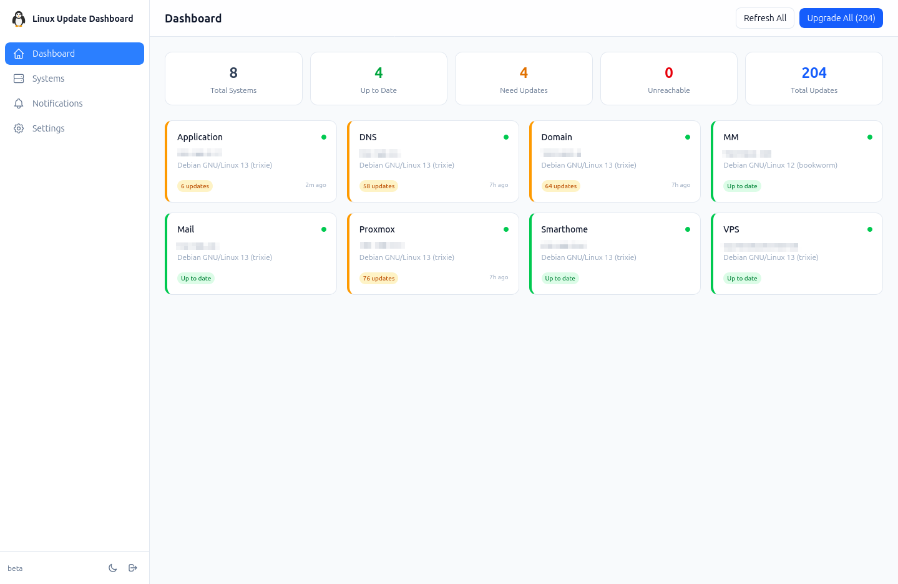
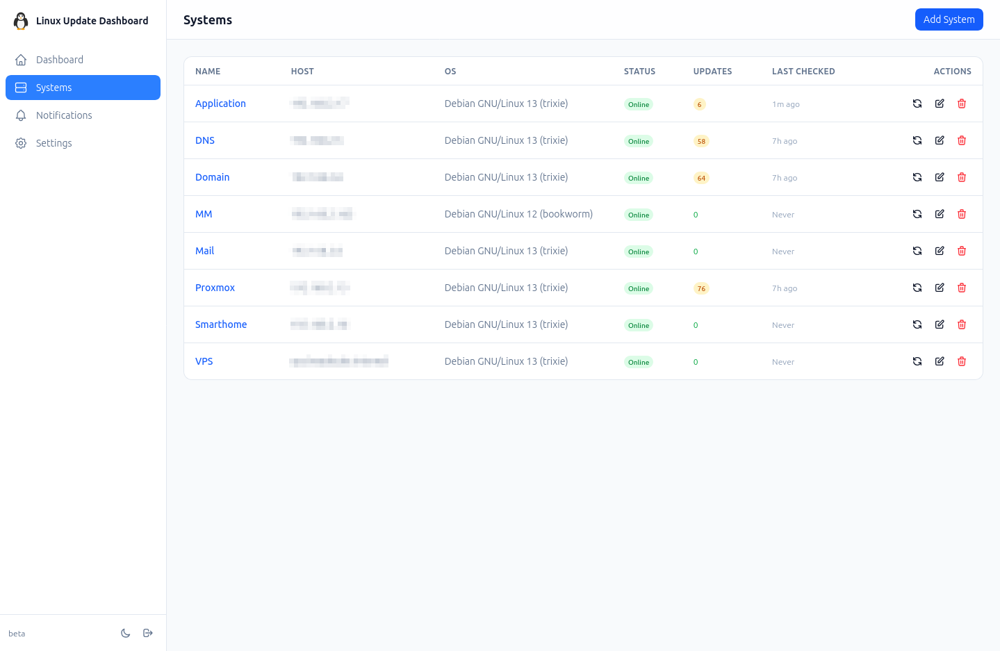
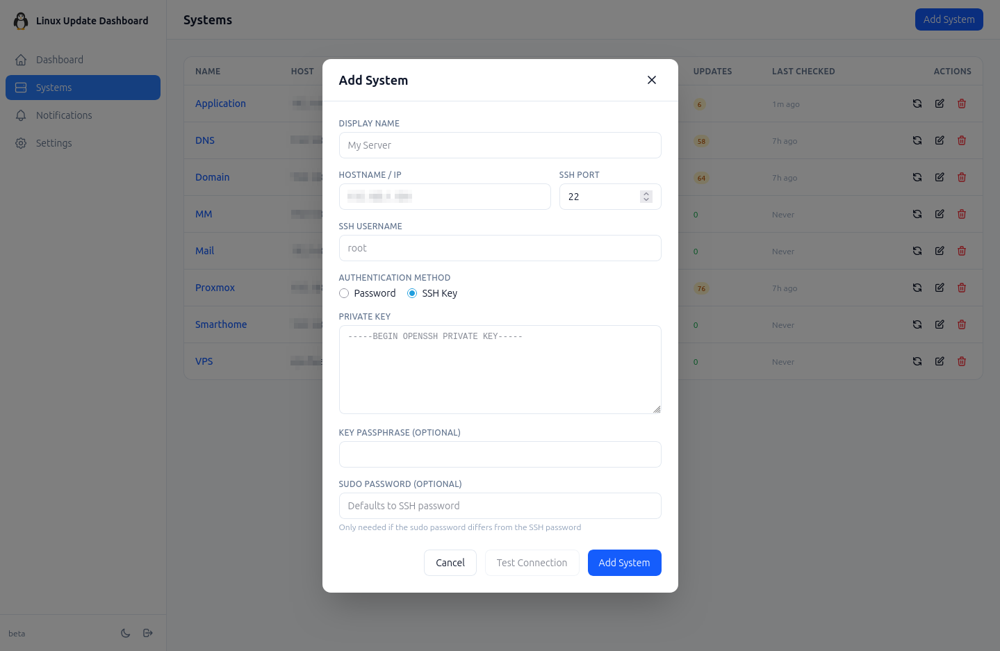
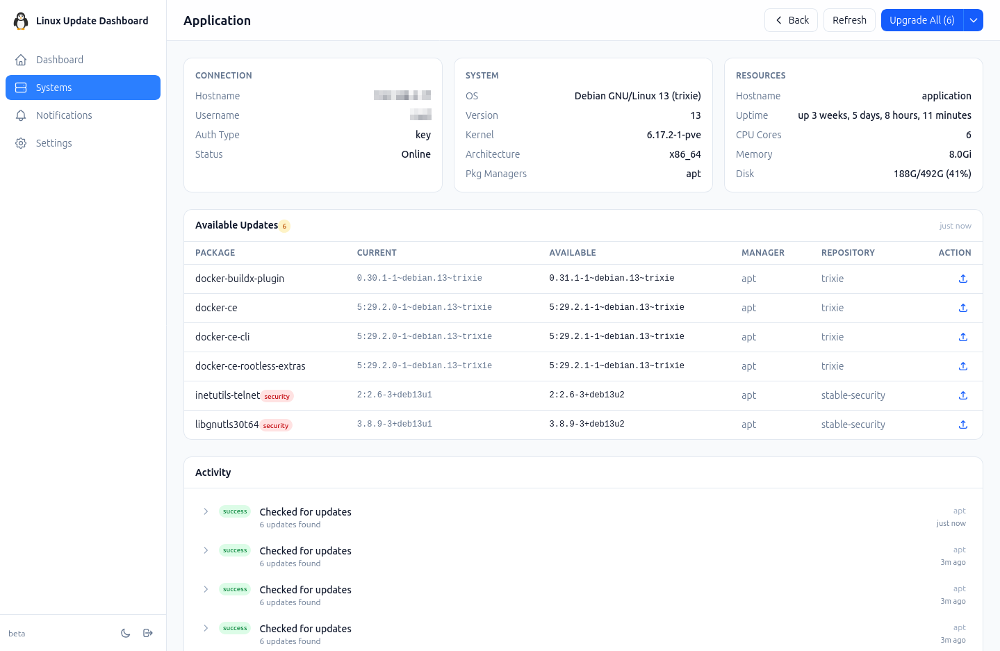
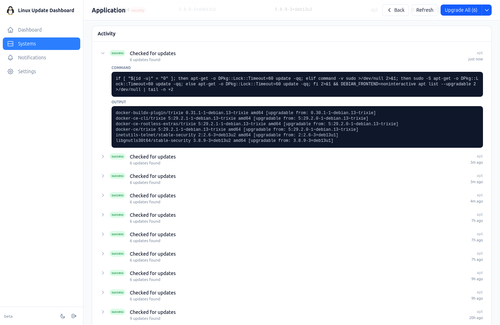
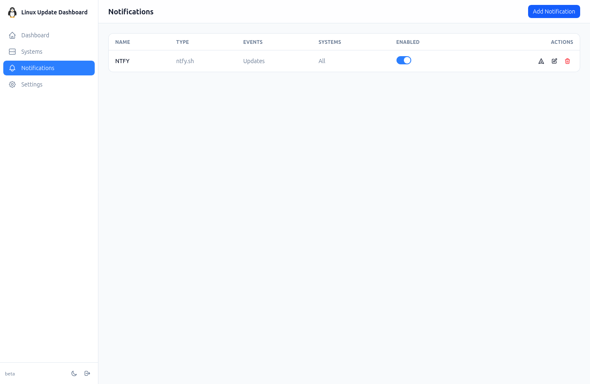
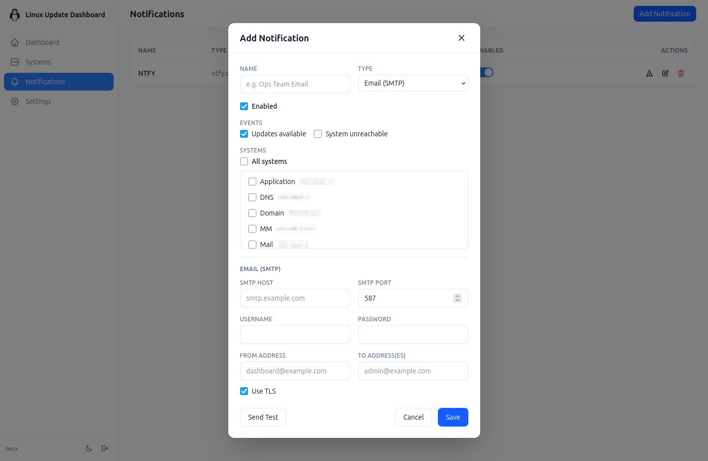
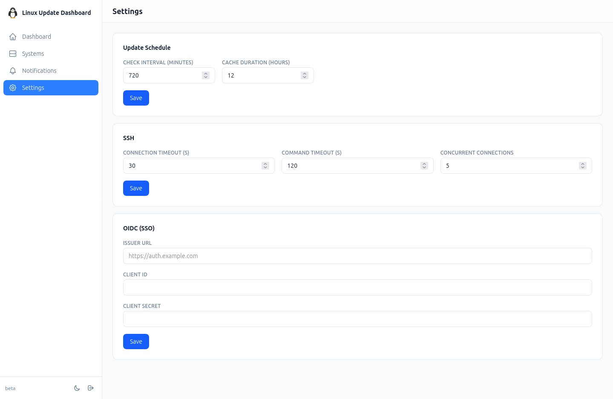

<div align="center">
  
</div>

<div align="center">

  [](https://github.com/TheDuffman85/linux-update-dashboard/actions/workflows/release.yml)
  [](https://github.com/TheDuffman85/linux-update-dashboard/actions/workflows/trivy-scan.yml)
  [](https://github.com/TheDuffman85/linux-update-dashboard/blob/main/LICENSE)
  [](https://github.com/TheDuffman85/linux-update-dashboard/commits/main)
  [](https://github.com/users/TheDuffman85/packages/container/package/linux-update-dashboard)

</div>

# Linux Update Dashboard

A self-hosted web app for managing Linux package updates across multiple servers. Connect via SSH, check for updates, and apply them from a single dashboard in your browser.

<div align="center">
  <a href="https://bun.sh/"></a>
  <a href="https://hono.dev/"></a>
  <a href="https://react.dev/"></a>
  <a href="https://vite.dev/"></a>
  <a href="https://tailwindcss.com/"></a>
  <a href="https://orm.drizzle.team/"></a>
  <a href="https://www.sqlite.org/"></a>
  <a href="https://www.docker.com/"></a>
</div>

## Features

- **Multi-distribution support:** APT (Debian/Ubuntu), DNF (Fedora/RHEL 8+), YUM (CentOS/older RHEL), Pacman (Arch/Manjaro), Flatpak, and Snap
- **Auto-detection:** package managers and system info are detected automatically on first connection; you can disable individual managers per system
- **Granular updates:** upgrade everything at once or pick individual packages per system
- **Background scheduling:** periodic checks keep your dashboard up to date (configurable cache duration)
- **Flexible notifications:** set up multiple channels per event type (Email/SMTP, ntfy.sh), scope them to specific systems, and pick which events trigger each channel
- **Encrypted credentials:** SSH passwords and private keys are encrypted at rest with AES-256-GCM
- **Three auth methods:** password, Passkeys (WebAuthn), and SSO (OpenID Connect)
- **SSH-safe upgrades:** upgrade commands run via nohup on the remote host, so they survive SSH disconnects and keep running even if the dashboard loses connection
- **Full upgrade:** run `apt full-upgrade` or `dnf distro-sync` from the dashboard for dist-level upgrades
- **Remote reboot:** trigger reboots from the UI with a dashboard-wide reboot-needed indicator
- **System duplication:** clone an existing system entry (including encrypted credentials) to quickly add similar servers
- **Exclude from Upgrade All:** flag individual systems to skip them during batch upgrades
- **Notification digests:** schedule notification delivery on a cron expression for batched digest summaries instead of immediate alerts
- **Dark mode:** dark/light theme with OS preference detection
- **Update history:** logs every check and upgrade operation per system
- **Real-time status:** see which systems are online, up to date, or need attention at a glance
- **Version info:** build version, commit hash, and branch displayed in the sidebar
- **Docker ready:** multi-stage Dockerfile with health check and a persistent volume for production

## Screenshots

### Dashboard
Overview of all systems with summary stats and color-coded update status at a glance.



### Systems List
Manage all connected servers with status, update counts, and quick actions.



### Add System
Add a new server via SSH with password or key-based authentication.



### System Detail
Detailed view of a single system showing connection info, OS details, resource usage, available packages, and upgrade history.



### Activity Log
Expandable history entries with the executed command and its full output.



### Notifications
Configure notification channels (Email/SMTP, ntfy.sh) with per-event and per-system filtering.





### Settings
Configure update schedules, SSH timeouts, and OIDC single sign-on.



## Quick Start

### Prerequisites

- [Bun](https://bun.sh) 1.x installed
- SSH access to at least one Linux server

### Installation

```bash
# Clone the repository
git clone https://github.com/your-username/linux-update-dashboard.git
cd linux-update-dashboard

# Install dependencies
bun install

# Generate an encryption key
export LUDASH_ENCRYPTION_KEY=$(bun -e "console.log(require('crypto').randomBytes(32).toString('base64'))")

# Start development servers
bun run dev
```

The frontend dev server runs on `http://localhost:5173` (proxies API calls to the backend on port 3001).

On first visit, you'll be guided through creating an admin account.

### Production Build

```bash
bun run build
NODE_ENV=production bun run start
```

The production server serves both the API and the built frontend on port 3001.

## Docker Deployment

### Using pre-built image (recommended)

```bash
# Generate your encryption key
export LUDASH_ENCRYPTION_KEY=$(openssl rand -base64 32)

# Pull and run
docker run -d \
  -p 3001:3001 \
  -e LUDASH_ENCRYPTION_KEY=$LUDASH_ENCRYPTION_KEY \
  -v ludash_data:/data \
  ghcr.io/theduffman85/linux-update-dashboard:latest
```

### Docker Compose

```yaml
services:
  dashboard:
    image: ghcr.io/theduffman85/linux-update-dashboard:latest
    container_name: linux-update-dashboard
    restart: unless-stopped
    ports:
      - "3001:3001"
    volumes:
      - dashboard_data:/data
    environment:
      - LUDASH_ENCRYPTION_KEY=${LUDASH_ENCRYPTION_KEY}
      - LUDASH_DB_PATH=/data/dashboard.db
      - NODE_ENV=production

volumes:
  dashboard_data:
```

The dashboard will be available at `http://localhost:3001`. Data is persisted in a Docker volume.

### Building locally

```bash
cd docker

# Generate your encryption key
export LUDASH_ENCRYPTION_KEY=$(openssl rand -base64 32)

# Start the container
docker compose up -d
```

### Health Check

The Docker image includes a built-in `HEALTHCHECK` that verifies the web server is responding. Docker will automatically mark the container as `healthy` or `unhealthy`.

**Endpoint:** `GET /api/health` (localhost: no auth, external: requires authentication)

```bash
curl http://localhost:3001/api/health
# {"status":"ok"}
```

The health check runs every 30 seconds with a 10-second start period to allow for initialization. You can check the container's health status with:

```bash
docker inspect --format='{{.State.Health.Status}}' linux-update-dashboard
```

## Environment Variables

| Variable | Required | Default | Description |
|----------|----------|---------|-------------|
| `LUDASH_ENCRYPTION_KEY` | **Yes** | - | AES-256 key for encrypting stored SSH credentials |
| `LUDASH_DB_PATH` | No | `./data/dashboard.db` | SQLite database file path |
| `LUDASH_SECRET_KEY` | No | Auto-generated | JWT session signing secret (auto-persisted to `.secret_key`) |
| `LUDASH_PORT` | No | `3001` | HTTP server port |
| `LUDASH_HOST` | No | `0.0.0.0` | HTTP server bind address |
| `LUDASH_BASE_URL` | No | `http://localhost:3001` | Public URL (needed for WebAuthn and OIDC) |
| `LUDASH_LOG_LEVEL` | No | `info` | Log level |
| `LUDASH_DEFAULT_CACHE_HOURS` | No | `12` | How long update results are cached before re-checking |
| `LUDASH_DEFAULT_SSH_TIMEOUT` | No | `30` | SSH connection timeout in seconds |
| `LUDASH_DEFAULT_CMD_TIMEOUT` | No | `120` | SSH command execution timeout in seconds |
| `LUDASH_MAX_CONCURRENT_CONNECTIONS` | No | `5` | Max simultaneous SSH connections |
| `NODE_ENV` | No | - | Set to `production` for static file serving |

## Authentication

Three auth methods are supported and can be used at the same time:

### Password

Standard username/password login. Passwords are hashed with bcrypt (cost factor 12). Sessions use long-lived JWTs (30-day expiry) in an HTTP-only cookie, with silent daily rolling refresh.

### Passkeys (WebAuthn)

Register hardware keys or platform authenticators (Touch ID, Windows Hello) for passwordless login. You need to set `LUDASH_BASE_URL` correctly for this to work.

### SSO (OpenID Connect)

Hook up any OIDC-compatible identity provider (Authentik, Keycloak, Okta, Auth0, etc.) through the Settings page. Users get auto-provisioned on first login. Set the callback URL in your provider to:

```
{LUDASH_BASE_URL}/api/auth/oidc/callback
```

## Supported Package Managers

| Package Manager | Distributions |
|----------------|---------------|
| APT | Debian, Ubuntu, Linux Mint |
| DNF | Fedora, RHEL 8+, AlmaLinux, Rocky |
| YUM | CentOS, older RHEL |
| Pacman | Arch Linux, Manjaro |
| Flatpak | Any (cross-distribution) |
| Snap | Any (cross-distribution) |

Package managers are auto-detected on each system over SSH when you test the connection or run the first check. Detected managers are enabled by default, and you can toggle them individually per system in the edit dialog. Security updates are identified where possible (e.g. APT security repos).

## Project Structure

```
├── .github/                  # CI/CD workflows and Dependabot
│   ├── dependabot.yml
│   └── workflows/
│       ├── dev-build.yml     # Dev branch Docker builds
│       ├── release.yml       # Production releases
│       └── trivy-scan.yml    # Container security scanning
├── client/                   # React SPA
│   ├── lib/                  # TanStack Query hooks and API client
│   ├── components/           # Shared UI components
│   ├── context/              # Auth and toast providers
│   ├── hooks/                # Custom hooks (theme)
│   ├── pages/                # Route pages
│   └── styles/               # Tailwind CSS
├── server/                   # Hono backend
│   ├── auth/                 # Password, WebAuthn, OIDC, session handling
│   ├── db/                   # SQLite + Drizzle schema (7 tables)
│   ├── middleware/            # Auth and rate-limit middleware
│   ├── routes/               # API route handlers
│   ├── services/             # Business logic, caching, scheduling
│   └── ssh/                  # SSH connection manager + parsers
├── tests/server/             # Bun test suites
├── docker/                   # Dockerfile, compose, entrypoint
│   └── test-systems/         # Docker test containers (6 distros)
├── run.sh                    # Local dev/production runner
├── reset-dev-branch.sh       # Reset dev branch to main
├── drizzle.config.ts         # Drizzle Kit configuration
├── vite.config.ts            # Vite + Tailwind config
└── package.json
```

## Development

There's a helper script `run.sh` to manage services.

**Development mode** (hot reload, server on :3001, client on :5173):
```bash
./run.sh dev
```

**Production mode** (build and start on :3001):
```bash
./run.sh
```

Or use the npm scripts directly:

```bash
# Start both dev servers (backend :3001 + Vite :5173 with HMR)
bun run dev

# Or run them individually
bun run dev:server           # Backend only (with watch mode)
bun run dev:client           # Vite frontend only

# Run tests
bun test

# Type check
bun run check

# Database management
bun run db:generate          # Generate migrations from schema changes
bun run db:migrate           # Apply pending migrations
bun run db:studio            # Open Drizzle Studio GUI
```

### Test Systems

The project includes Docker-based test systems that simulate real Linux servers with pending updates. This lets you develop and test the dashboard without needing actual remote machines.

**Start the dashboard with test systems:**
```bash
./run.sh test
```

This will:
1. Stop any running dev/production services
2. Build and start 6 Docker containers (one per package manager)
3. Build the frontend in production mode
4. Run database migrations
5. Start the production server on `:3001`

**SSH credentials for all test systems:**
- User: `testuser`
- Password: `testpass`
- Passwordless `sudo` is pre-configured

| Container | SSH Port | Package Manager | Base Image |
|-----------|----------|-----------------|------------|
| `ludash-test-ubuntu` | 2001 | APT | Ubuntu 24.04 |
| `ludash-test-fedora` | 2002 | DNF | Fedora 41 |
| `ludash-test-centos7` | 2003 | YUM | CentOS 7 |
| `ludash-test-archlinux` | 2004 | Pacman | Arch Linux |
| `ludash-test-flatpak` | 2005 | Flatpak | Ubuntu 24.04 |
| `ludash-test-snap` | 2006 | Snap | Ubuntu 24.04 |

To add a test system in the dashboard, use `host.docker.internal` (or `172.17.0.1` on Linux) as the hostname with the corresponding SSH port.

Each container is built with **older package versions** pinned from archived repositories, while current repos remain active. This means `apt list --upgradable`, `dnf check-update`, `pacman -Qu`, etc. will always report pending updates — giving you realistic data to work with in the dashboard.

The Docker Compose file and all Dockerfiles are in [`docker/test-systems/`](docker/test-systems/).

### Branch Management

To reset the `dev` branch to match `main` (force push):
```bash
./reset-dev-branch.sh
```

## API Overview

All endpoints require authentication unless noted. Responses are JSON.

### Health

| Method | Endpoint | Description |
|--------|----------|-------------|
| GET | `/api/health` | Health check (localhost: no auth, external: requires auth) |

### Auth (`/api/auth/*`)

| Method | Endpoint | Description |
|--------|----------|-------------|
| GET | `/api/auth/status` | Auth state, setup status, OIDC availability |
| POST | `/api/auth/setup` | Create initial admin account |
| POST | `/api/auth/login` | Password login |
| POST | `/api/auth/logout` | Clear session |
| GET | `/api/auth/me` | Current user info |
| POST | `/api/auth/webauthn/register/options` | Start passkey registration |
| POST | `/api/auth/webauthn/register/verify` | Complete passkey registration |
| POST | `/api/auth/webauthn/login/options` | Start passkey login |
| POST | `/api/auth/webauthn/login/verify` | Complete passkey login |
| GET | `/api/auth/oidc/login` | Redirect to OIDC provider |
| GET | `/api/auth/oidc/callback` | OIDC callback handler |

### Systems (`/api/systems/*`)

| Method | Endpoint | Description |
|--------|----------|-------------|
| GET | `/api/systems` | List all systems with update counts |
| GET | `/api/systems/:id` | System detail with updates and history |
| POST | `/api/systems` | Add a new system |
| PUT | `/api/systems/:id` | Update system configuration |
| DELETE | `/api/systems/:id` | Remove a system |
| POST | `/api/systems/test-connection` | Test SSH connectivity |
| POST | `/api/systems/:id/reboot` | Reboot a system |
| GET | `/api/systems/:id/updates` | Cached updates for a system |
| GET | `/api/systems/:id/history` | Upgrade history for a system |

### Updates

| Method | Endpoint | Description |
|--------|----------|-------------|
| POST | `/api/systems/:id/check` | Check one system for updates |
| POST | `/api/systems/check-all` | Check all systems (background) |
| POST | `/api/systems/:id/upgrade` | Upgrade all packages on a system |
| POST | `/api/systems/:id/full-upgrade` | Full/dist upgrade on a system |
| POST | `/api/systems/:id/upgrade/:packageName` | Upgrade a single package |
| POST | `/api/cache/refresh` | Invalidate cache and re-check all systems |
| GET | `/api/jobs/:id` | Poll background job status |

### Notifications (`/api/notifications/*`)

| Method | Endpoint | Description |
|--------|----------|-------------|
| GET | `/api/notifications` | List all notification channels |
| GET | `/api/notifications/:id` | Get a notification channel |
| POST | `/api/notifications` | Create a notification channel |
| PUT | `/api/notifications/:id` | Update a notification channel |
| DELETE | `/api/notifications/:id` | Delete a notification channel |
| POST | `/api/notifications/test` | Test a notification config inline (before saving) |
| POST | `/api/notifications/:id/test` | Send a test notification |

### Dashboard & Settings

| Method | Endpoint | Description |
|--------|----------|-------------|
| GET | `/api/dashboard/stats` | Summary statistics |
| GET | `/api/dashboard/systems` | All systems with status metadata |
| GET | `/api/settings` | Current settings |
| PUT | `/api/settings` | Update settings |

## Security

- **Credential encryption:** SSH passwords and private keys are encrypted at rest using AES-256-GCM with per-entry random IVs and auth tags
- **Notification secrets:** SMTP passwords and ntfy tokens are also encrypted at rest within notification channel configs
- **Key derivation:** supports both raw base64 keys and passphrase-derived keys (PBKDF2-SHA256, 480k iterations)
- **Session security:** HTTP-only, SameSite=Lax cookies with JWT (HS256)
- **Input validation:** strict type, format, and range validation on all API inputs
- **SSRF protection:** outbound notification URLs are validated against private/internal IP ranges
- **Rate limiting:** auth endpoints are rate-limited (3 req/min for setup, 5 req/min for login and WebAuthn verify)
- **Timing-safe login:** a pre-computed dummy hash is always compared on failed lookups to prevent username enumeration
- **Encrypted OIDC secrets:** OIDC client secrets are encrypted at rest alongside SSH credentials
- **Passphrase key derivation:** encryption keys can be raw base64 or passphrases derived via PBKDF2-SHA256 (480k iterations)
- **Concurrent access control:** per-system mutex prevents conflicting SSH operations
- **Connection pooling:** semaphore-based concurrency limiting to prevent SSH connection exhaustion

## SSH-Safe Upgrades

All upgrade operations (upgrade all, full upgrade, single package) run via **nohup** on the remote system, so they survive SSH connection drops. If your network blips or the dashboard restarts mid-upgrade, the process keeps running on the server.

### How it works

1. **Sudo pre-caching** — sudo credentials are cached on the remote host before the upgrade starts, so the background process can elevate without a password prompt.
2. **Temp script** — the upgrade command is base64-encoded, written to a temporary script on the remote host, and launched with `nohup` in the background.
3. **Live streaming** — output is streamed back to the dashboard in real time using `tail --pid`, which automatically stops when the process finishes.
4. **Exit code capture** — the script writes its exit code to a companion file, which the dashboard reads after the process completes.
5. **Graceful degradation** — if the nohup setup fails (e.g. `mktemp` unavailable), the command falls back to direct SSH execution automatically.

### Connection loss during upgrade

If the SSH connection drops while monitoring, the dashboard shows a warning:

> *SSH connection lost during upgrade. The process may still be running on the remote system.*

The upgrade itself continues on the remote host unaffected. Temporary files are cleaned up once the exit code is read.

### What uses SSH-safe mode

| Operation | SSH-safe |
|-----------|----------|
| Upgrade all packages | Yes |
| Full upgrade (dist upgrade) | Yes |
| Upgrade single package | Yes |
| Check for updates | No (read-only, safe to retry) |
| Reboot | No (fire-and-forget) |

The UI marks SSH-safe operations with an **SSH-safe** badge in the activity history.

## Star History

[](https://star-history.com/#TheDuffman85/linux-update-dashboard&Date)