<div align="center">
  
</div>

<div align="center">

[](https://github.com/TheDuffman85/linux-update-dashboard/actions/workflows/release.yml)
[](https://github.com/TheDuffman85/linux-update-dashboard/actions/workflows/trivy-scan.yml)
[](https://github.com/TheDuffman85/linux-update-dashboard/blob/main/LICENSE)
[](https://github.com/TheDuffman85/linux-update-dashboard/commits/main)
[](https://github.com/users/TheDuffman85/packages/container/package/linux-update-dashboard)

</div>

# Linux Update Dashboard

A self-hosted web app for managing Linux package updates across multiple servers. Connect via SSH, check for updates, and apply them from a single dashboard in your browser.

<div align="center">
  <a href="https://nodejs.org/"></a>
  <a href="https://pnpm.io/"></a>
  <a href="https://hono.dev/"></a>
  <a href="https://react.dev/"></a>
  <a href="https://vite.dev/"></a>
  <a href="https://tailwindcss.com/"></a>
  <a href="https://orm.drizzle.team/"></a>
  <a href="https://www.sqlite.org/"></a>
  <a href="https://www.docker.com/"></a>
</div>

## Features

- **Multi-distribution support:** APT (Debian/Ubuntu), DNF (Fedora/RHEL 8+), YUM (CentOS/older RHEL), Pacman (Arch/Manjaro), APK (Alpine), Flatpak, and Snap
- **Reusable credential vault:** store username/password, SSH key, or OpenSSH certificate credentials once and reuse them across systems
- **Auto-detection:** package managers and system info are detected automatically on first connection; you can disable individual managers per system
- **Per-system package-manager behavior:** configure manager-specific upgrade/check behavior such as APT full-upgrade defaults, DNF distro-sync defaults, and refresh toggles for DNF, Pacman, APK, and Flatpak
- **Script customization:** inspect built-in SSH command scripts, copy them into editable custom scripts, add custom package managers, and assign per-system script overrides
- **Granular updates:** upgrade everything at once, queue grouped Upgrade All batches, pick individual packages, or autoremove unused packages per system
- **Installed package inventory:** collect installed package versions during refreshes and browse the cached snapshot from each system detail page
- **Cron-based scheduling:** create refresh, update, and notification schedules with per-schedule system scope and cache behavior
- **APT kept-back auto-hide:** optionally move kept-back APT packages into the hidden-updates list for specific systems so they disappear from visible counts and dashboards
- **Flexible notifications:** set up multiple channels per event type (Email/SMTP, Gotify, MQTT, ntfy.sh, Telegram, Webhooks), scope them to specific systems, and pick which events trigger each channel
- **Home Assistant MQTT update entities:** publish one Linux Update Dashboard app update entity plus per-system package update entities with discovery, icons/images, rich JSON attributes, and optional install commands
- **Telegram bot integration:** bind a private Telegram chat for notifications, with optional bot commands for refresh and upgrades
- **Safer SSH workflows:** optional host-key verification with explicit trust approval, plus ProxyJump support for reaching internal hosts
- **Encrypted credentials:** SSH passwords and private keys are encrypted at rest with AES-256-GCM
- **Four auth methods:** password, Passkeys (WebAuthn), SSO (OpenID Connect), and API tokens for external integrations
- **SSH-safe maintenance:** upgrade and autoremove commands run via nohup on the remote host, so they survive SSH disconnects and keep running even if the dashboard loses connection
- **Full upgrade:** run `apt full-upgrade` or `dnf distro-sync` from the dashboard for dist-level upgrades
- **Remote reboot:** trigger reboots from the UI with a dashboard-wide reboot-needed indicator
- **System duplication:** clone an existing system entry (including encrypted credentials) to quickly add similar servers
- **Exclude from Upgrade All:** make individual systems start unchecked in the Upgrade All Systems dialog
- **Upgrade groups:** organize systems into ordered groups so Upgrade All can run systems in the same group together before moving to the next group
- **Visibility controls:** hide systems from the main dashboard without deleting them
- **Notification schedules:** deliver notifications immediately or batch them on one or more cron-based schedules
- **Dark mode:** dark/light theme with OS preference detection
- **Update history:** logs every check and upgrade operation per system
- **Real-time status:** see which systems are online, up to date, or need attention at a glance
- **Version info:** build version, commit hash, and branch displayed in the sidebar
- **Docker ready:** multi-stage Dockerfile with health check and a persistent volume for production

## Screenshots

### Dashboard

Overview of all systems with summary cards, update totals, and color-coded status tiles for quick triage.

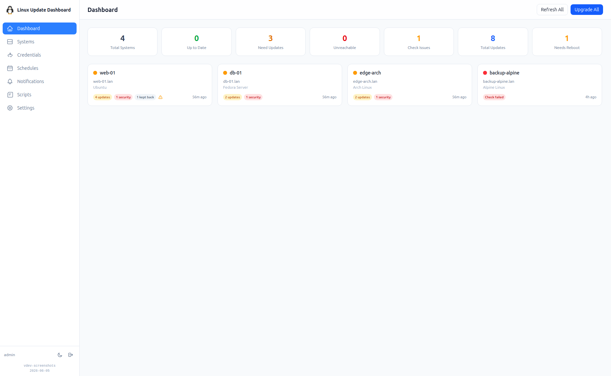

### Upgrade All Systems

Queue grouped upgrade batches, choose which systems participate, and run ordered maintenance windows from one dialog.

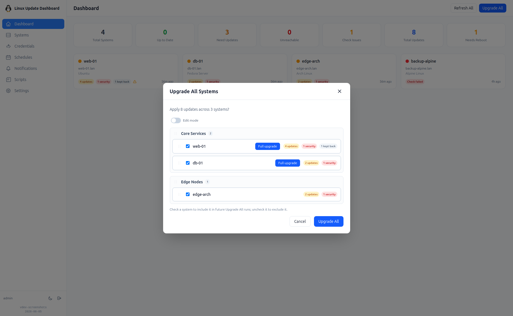

### System Detail

Detailed system view with connection data, OS and resource information, available updates, and expandable activity output.

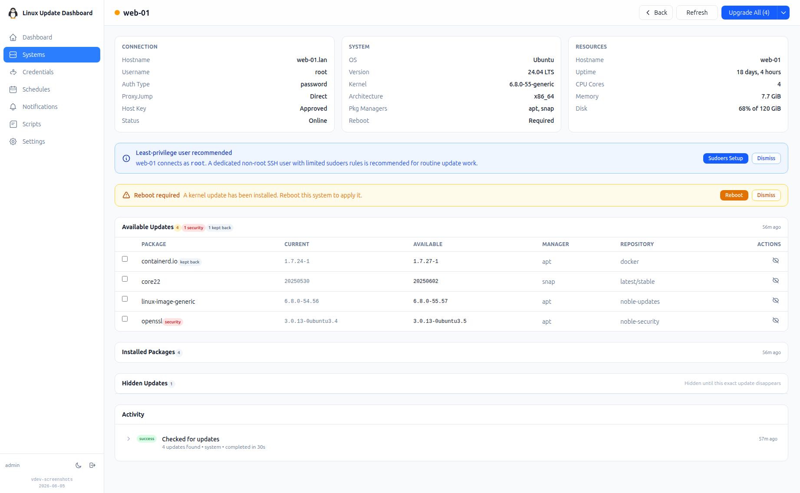

### Sudoers Setup

Generate a least-privilege sudoers allowlist from the commands configured for a system.

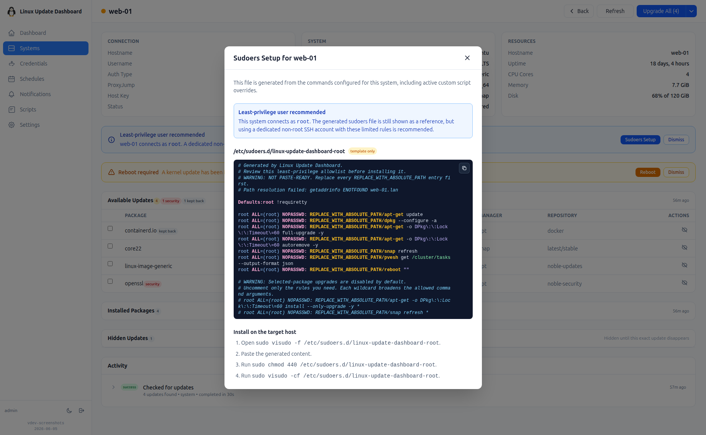

### Systems List

Table view of all configured systems with OS, status badges, last check time, and quick actions.

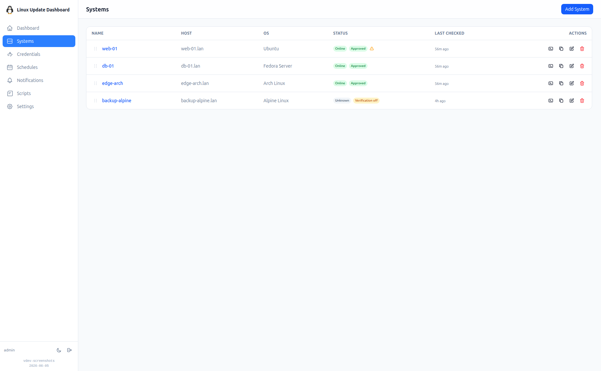

### Edit System

Edit an existing system's connection settings, SSH credential, host-key approval, and visibility options.

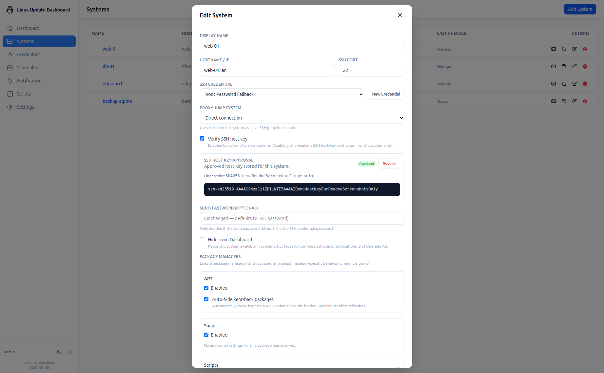

### Credentials

Manage saved SSH credentials and see which systems reference each one.

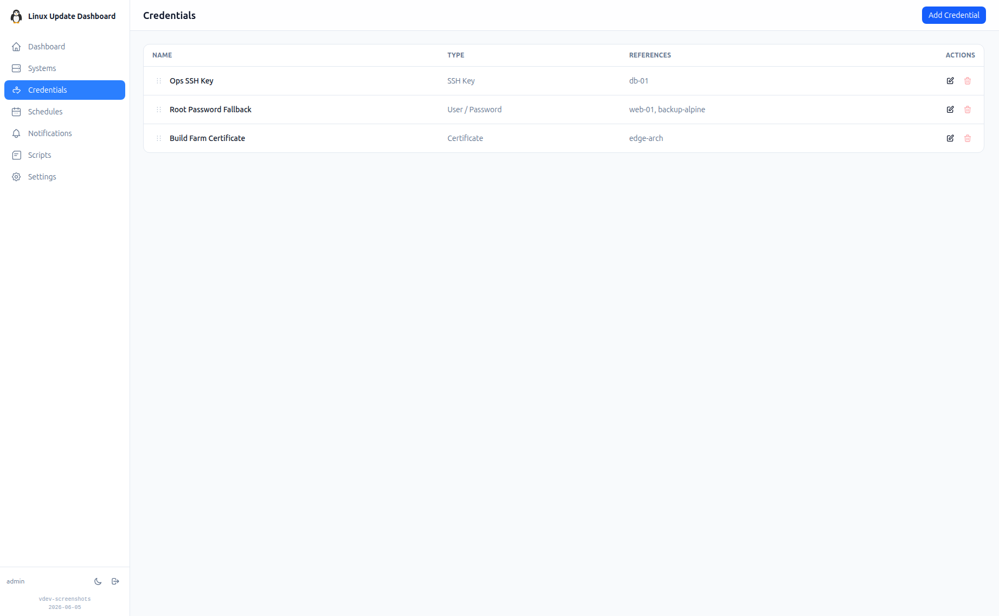

### Add Credential

Create a new SSH key or password credential for reuse across systems.

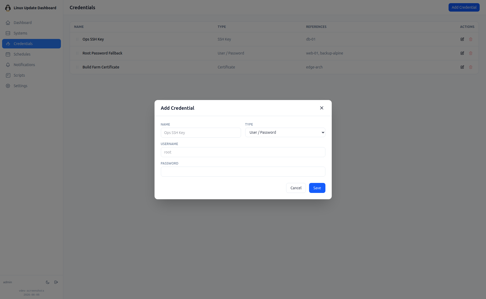

### Schedules

Create cron-based refresh, update, and notification schedules with per-schedule system scope and run history.

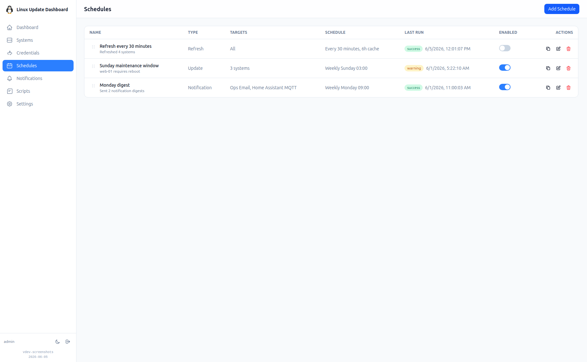

### Notifications

Manage notification channels with delivery status, enabled state, supported events, and per-channel actions.

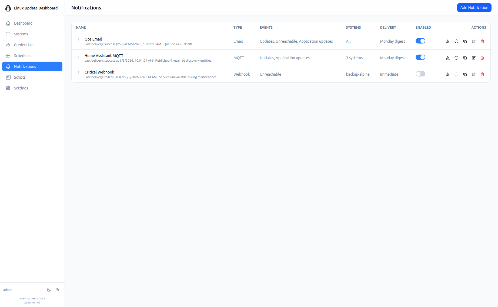

### Add Notification

Configure a new notification channel with event filters, system scope, schedule, and provider-specific fields.

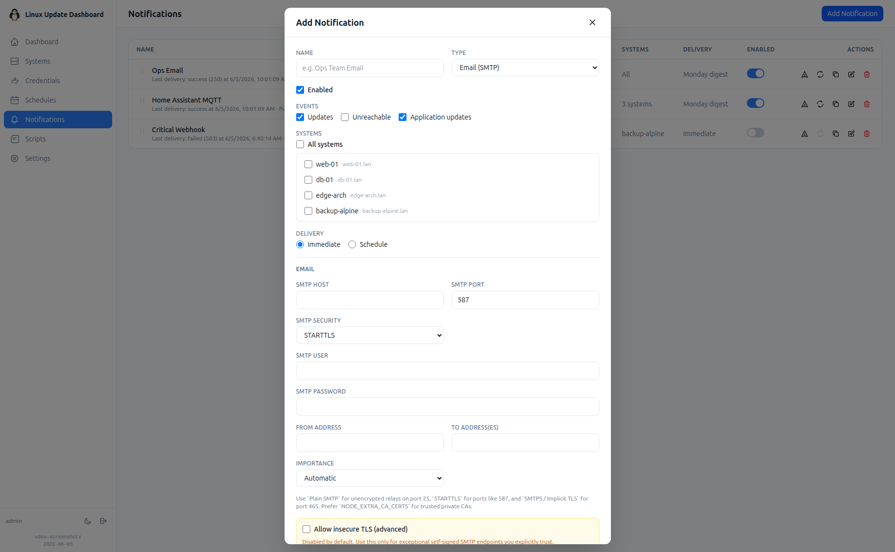

### Scripts

Inspect built-in command scripts, manage custom package managers, and assign reusable custom script overrides.

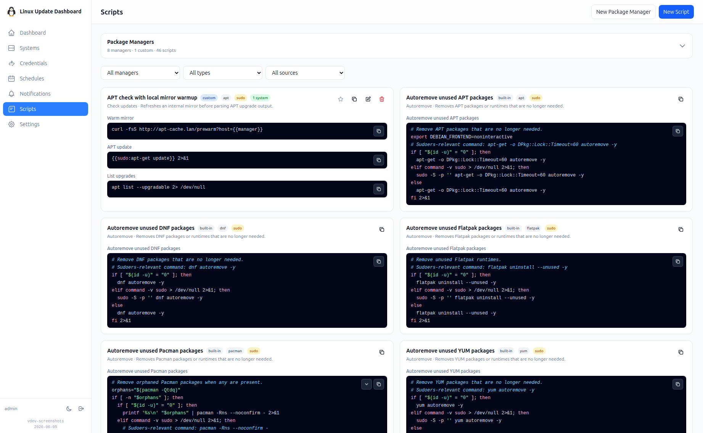

### Settings

Configure activity history retention, SSH timeouts, password settings, SSO, passkeys, and API tokens.

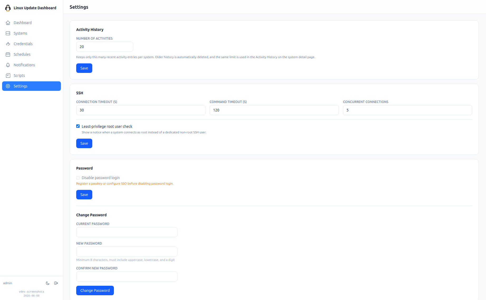

## Quick Start

> [!CAUTION]
> **This application is designed for use on trusted local networks only.** It is **not** intended to be exposed directly to the internet. If you need remote access, place it behind a reverse proxy with proper TLS termination, authentication, and network-level access controls (e.g. VPN, firewall rules).

> [!IMPORTANT]
> **HTTPS is recommended for normal use.** Plain HTTP works for basic dashboard access on trusted local networks, but browsers restrict some features outside secure contexts. On HTTP, passkeys/WebAuthn will not be available, clipboard copy actions may fail or require manual copying, and browser security rules can vary by hostname or IP address. If you use a reverse proxy, set `LUDASH_BASE_URL` to the public `https://...` URL and enable `LUDASH_TRUST_PROXY=true`.

### Prerequisites

- Node.js 24.15.0 installed
- pnpm 10.33.0 available via Corepack or a global install
- SSH access to at least one Linux server

### Installation

```bash
# Clone the repository
git clone https://github.com/TheDuffman85/linux-update-dashboard.git
cd linux-update-dashboard

# Activate the pinned pnpm version
corepack enable
corepack prepare pnpm@10.33.0 --activate

# Install dependencies
pnpm install

# Generate an encryption key
export LUDASH_ENCRYPTION_KEY=$(openssl rand -base64 32)

# Start development servers
pnpm run dev
```

The frontend dev server runs on `http://localhost:5173` (proxies API calls to the backend on port 3001).

On first visit, you'll be guided through creating an admin account.

### Production Build

```bash
pnpm run build
NODE_ENV=production pnpm run start
```

The production server serves both the API and the built frontend on port 3001.

## Docker Deployment

### Using pre-built image (recommended)

```bash
# Generate your encryption key (required)
export LUDASH_ENCRYPTION_KEY=$(openssl rand -base64 32)
export LUDASH_BASE_URL=http://localhost:3001

# Pull and run
docker run -d \
  -p 3001:3001 \
  -e LUDASH_ENCRYPTION_KEY=$LUDASH_ENCRYPTION_KEY \
  -e LUDASH_BASE_URL=$LUDASH_BASE_URL \
  -v ludash_data:/data \
  ghcr.io/theduffman85/linux-update-dashboard:latest
```

Set `LUDASH_BASE_URL` to the URL users and integrations will actually use. If you run behind a reverse proxy, also add `-e LUDASH_TRUST_PROXY=true`.

Optional Docker Secrets variant:

```bash
mkdir -p ./secrets
openssl rand -base64 32 > ./secrets/ludash_encryption_key.txt
export LUDASH_BASE_URL=http://localhost:3001

docker run -d \
  -p 3001:3001 \
  -e LUDASH_ENCRYPTION_KEY_FILE=/run/secrets/ludash_encryption_key \
  -e LUDASH_BASE_URL=$LUDASH_BASE_URL \
  -v "$(pwd)/secrets/ludash_encryption_key.txt:/run/secrets/ludash_encryption_key:ro" \
  -v ludash_data:/data \
  ghcr.io/theduffman85/linux-update-dashboard:latest
```

### Docker Compose

```yaml
services:
  dashboard:
    image: ghcr.io/theduffman85/linux-update-dashboard:latest
    container_name: linux-update-dashboard
    restart: unless-stopped
    ports:
      - "3001:3001"
    volumes:
      - dashboard_data:/data
    environment:
      - LUDASH_ENCRYPTION_KEY=${LUDASH_ENCRYPTION_KEY}
      - TZ=Europe/Berlin
      # Optional: use Docker secrets instead of direct env vars
      # - LUDASH_ENCRYPTION_KEY_FILE=/run/secrets/ludash_encryption_key
      # - LUDASH_SECRET_KEY_FILE=/run/secrets/ludash_secret_key
      - LUDASH_DB_PATH=/data/dashboard.db
      - LUDASH_BASE_URL=http://localhost:3001
      - NODE_ENV=production
      # If you run behind a reverse proxy, set the public URL and trust forwarded headers:
      # - LUDASH_BASE_URL=https://dashboard.example.com
      # - LUDASH_TRUST_PROXY=true

volumes:
  dashboard_data:
```

The dashboard will be available at `http://localhost:3001`. Data is persisted in a Docker volume.

Set `LUDASH_BASE_URL` in all deployments. Use the external URL when the dashboard is accessed through a DNS name or reverse proxy.

To use a local timezone instead of UTC, set the standard Docker `TZ` environment variable, for example `TZ=Europe/Berlin`. Notification scheduling follows the container timezone.

If you prefer Docker secrets with Compose, add a `secrets:` block and set `LUDASH_ENCRYPTION_KEY_FILE` instead of `LUDASH_ENCRYPTION_KEY`.

Example:

```yaml
services:
  dashboard:
    image: ghcr.io/theduffman85/linux-update-dashboard:latest
    container_name: linux-update-dashboard
    restart: unless-stopped
    ports:
      - "3001:3001"
    volumes:
      - dashboard_data:/data
    environment:
      - LUDASH_ENCRYPTION_KEY_FILE=/run/secrets/ludash_encryption_key
      - LUDASH_DB_PATH=/data/dashboard.db
      - LUDASH_BASE_URL=http://localhost:3001
      - NODE_ENV=production
      # - LUDASH_TRUST_PROXY=true
    secrets:
      - ludash_encryption_key

secrets:
  ludash_encryption_key:
    file: ./secrets/ludash_encryption_key.txt

volumes:
  dashboard_data:
```

Create the secret file before starting:

```bash
mkdir -p ./secrets
openssl rand -base64 32 > ./secrets/ludash_encryption_key.txt
docker compose up -d
```

### Building locally

```bash
cd docker

# Generate your encryption key (required)
export LUDASH_ENCRYPTION_KEY=$(openssl rand -base64 32)
export LUDASH_BASE_URL=http://localhost:3001
export TZ=Europe/Berlin

# Start the container
docker compose up -d
```

If the container is behind a reverse proxy, set `LUDASH_BASE_URL` to the public HTTPS URL and add `LUDASH_TRUST_PROXY=true` in the Compose file.

### Health Check

The Docker image includes a built-in `HEALTHCHECK` that verifies the web server is responding. Docker will automatically mark the container as `healthy` or `unhealthy`.

**Endpoint:** `GET /api/health` (localhost: no auth, external: requires authentication)

```bash
curl http://localhost:3001/api/health
# {"status":"ok"}
```

The health check runs every 30 seconds with a 10-second start period to allow for initialization. You can check the container's health status with:

```bash
docker inspect --format='{{.State.Health.Status}}' linux-update-dashboard
```

## Environment Variables

| Variable                               | Required | Default                 | Description                                                                                                                                                                       |
| -------------------------------------- | -------- | ----------------------- | --------------------------------------------------------------------------------------------------------------------------------------------------------------------------------- |
| `LUDASH_ENCRYPTION_KEY`                | **Yes**  | -                       | AES-256 key for encrypting stored SSH credentials                                                                                                                                 |
| `LUDASH_ENCRYPTION_KEY_FILE`           | No       | -                       | Optional alternative: read `LUDASH_ENCRYPTION_KEY` value from file (Docker secrets)                                                                                               |
| `LUDASH_DB_PATH`                       | No       | `./data/dashboard.db`   | SQLite database file path                                                                                                                                                         |
| `LUDASH_SECRET_KEY`                    | No       | Auto-generated          | JWT session signing secret (auto-persisted to `.secret_key`)                                                                                                                      |
| `LUDASH_SECRET_KEY_FILE`               | No       | Auto-generated          | Read `LUDASH_SECRET_KEY` value from file (Docker secrets)                                                                                                                         |
| `LUDASH_PORT`                          | No       | `3001`                  | HTTP server port                                                                                                                                                                  |
| `LUDASH_HOST`                          | No       | `0.0.0.0`               | HTTP server bind address                                                                                                                                                          |
| `LUDASH_BASE_URL`                      | No       | `http://localhost:3001` | Recommended to always set. Public URL used for WebAuthn/OIDC and Home Assistant URLs such as `entity_picture`/`origin.url`. Set it to the URL users and integrations actually use |
| `LUDASH_TRUST_PROXY`                   | No       | `false`                 | Set to `true` behind a reverse proxy so `X-Forwarded-*` headers are trusted. Recommended whenever the public URL is provided by a proxy                                           |
| `TZ`                                   | No       | `UTC`                   | Standard container timezone used by Docker and Node.js. Set it to a value like `Europe/Berlin` if you want the UI and notification times to use a specific timezone               |
| `LUDASH_LOG_LEVEL`                     | No       | `info`                  | Server log level: `debug`, `info`, `warn`, or `error`. Routine per-attempt SSH and scheduler refresh logs are only shown at `debug`                                               |
| `LUDASH_DEFAULT_CACHE_HOURS`           | No       | `12`                    | How long update results are reused before re-checking; `0` disables cache reuse                                                                                                   |
| `LUDASH_DEFAULT_SSH_TIMEOUT`           | No       | `30`                    | SSH connection timeout in seconds                                                                                                                                                 |
| `LUDASH_DEFAULT_CMD_TIMEOUT`           | No       | `120`                   | SSH command execution timeout in seconds                                                                                                                                          |
| `LUDASH_MAX_CONCURRENT_CONNECTIONS`    | No       | `5`                     | Max simultaneous SSH connections                                                                                                                                                  |
| `LUDASH_MIN_SCHEDULE_INTERVAL_MINUTES` | No       | `5`                     | Minimum allowed interval for cron-based schedules                                                                                                                                 |
| `NODE_EXTRA_CA_CERTS`                  | No       | -                       | Path to a PEM CA bundle to trust additional/self-signed certificates for outbound TLS (OIDC, SMTP, Gotify, ntfy, webhooks, etc.)                                                  |
| `NODE_ENV`                             | No       | -                       | Set to `production` for static file serving                                                                                                                                       |

If you use `LUDASH_ENCRYPTION_KEY_FILE`, do not also set `LUDASH_ENCRYPTION_KEY`. If both `VAR` and `VAR_FILE` are set for the same setting, startup fails with a configuration error.

## Update Scheduling

Scheduling is managed from the **Schedules** page. Existing installs are migrated
to an enabled **Default refresh** schedule using the previous refresh interval and
cache duration settings.

- **Refresh schedules:** run on a cron expression and re-check scoped systems whose cached results are stale
- **Update schedules:** run on a cron expression, refresh scoped systems first, then run the normal per-system Upgrade action where visible updates remain
- **Notification schedules:** run on a cron expression and deliver batched events for every assigned notification channel

Schedules use standard five-field cron expressions in the container timezone. Set the Docker `TZ` environment variable, such as `TZ=Europe/Berlin`, when you want schedules to follow a local timezone instead of UTC. The default minimum interval is **5 minutes**; schedules that run more frequently are rejected by the API. Set `LUDASH_MIN_SCHEDULE_INTERVAL_MINUTES` to adjust the server-side limit. If you build the client yourself and change the server limit, set `VITE_MIN_SCHEDULE_INTERVAL_MINUTES` to the same value so UI warnings match.

Set a refresh schedule's cache duration to `0` to disable cache reuse. Manual refreshes, server restarts, and newly added systems can still trigger immediate checks outside configured schedules. Notification channels can be assigned to multiple notification schedules, and the same pending event batch is delivered when any selected schedule runs.

## Upgrade All Groups

The **Upgrade All Systems** dialog can save an upgrade order with optional groups. Systems in the same group run together; the next group starts only after every queued system in the current group finishes. Ungrouped systems are kept in the same ordered flow and can be positioned before, between, or after named groups.

Use edit mode in the dialog to create, rename, delete, and reorder groups, or drag systems between groups. Hidden systems and systems excluded from Upgrade All are not queued unless you explicitly include eligible visible systems in the dialog.

## Debugging SSH Connection Failures

For container-based installs, set `LUDASH_LOG_LEVEL=debug` and inspect the container logs:

```bash
docker logs -f linux-update-dashboard
```

At the default `info` level, the server logs startup, configuration, warnings, and errors without emitting per-attempt SSH connect start/success lines on every refresh. `debug` adds attempt-scoped SSH diagnostics and routine scheduler refresh logs to stdout/stderr so they appear in `docker logs`. Failed test-connection requests include a debug reference ID that you can match against the log entries.

Security constraints:

- Logged SSH diagnostics are intentionally limited to safe metadata such as host, port, username, auth type, elapsed time, and filtered auth/debug events.
- Passwords, sudo passwords, private keys, passphrases, tokens, and raw SSH payloads are never logged.
- If a diagnostic cannot be emitted safely, it is omitted.

These logs are intended for trusted operators on trusted hosts. Avoid enabling debug logging longer than needed.

## Authentication

Four auth methods are supported and can be used at the same time:

### Password

Standard username/password login. Passwords are hashed with bcrypt (cost factor 12). Sessions use long-lived JWTs (30-day expiry) in an HTTP-only cookie, with silent daily rolling refresh. Can be disabled from the Settings page, but only when at least one passkey or SSO provider is configured (enforced server-side to prevent lockout). Users can change their password from the Settings page.

> **Note:** Password login cannot be disabled unless at least one passkey or SSO provider is configured, preventing account lockout.

### Passkeys (WebAuthn)

Register hardware keys or platform authenticators (Touch ID, Windows Hello) for passwordless login. Each passkey can be given a custom name (e.g. "YubiKey", "MacBook") during registration and renamed later from the Settings page. Set `LUDASH_BASE_URL` to the public URL you use to access the dashboard. Behind a reverse proxy, also set `LUDASH_TRUST_PROXY=true`.

### SSO (OpenID Connect)

Hook up any OIDC-compatible identity provider (Authentik, Keycloak, Okta, Auth0, etc.) through the Settings page. Users get auto-provisioned on first login. Set the callback URL in your provider to:

```
{LUDASH_BASE_URL}/api/auth/oidc/callback
```

`LUDASH_BASE_URL` should be explicitly set before configuring OIDC so the callback and origin validation stay aligned with your public URL.

#### Self-signed CA support

If your IdP (or other outbound HTTPS target) uses a private/self-signed CA, mount the CA cert into the container and set `NODE_EXTRA_CA_CERTS`:

```yaml
services:
  dashboard:
    image: ghcr.io/theduffman85/linux-update-dashboard:latest
    volumes:
      - ./certs/homelab-ca.crt:/etc/ssl/certs/homelab-ca.crt:ro
    environment:
      - NODE_EXTRA_CA_CERTS=/etc/ssl/certs/homelab-ca.crt
```

For non-Docker runs, set `NODE_EXTRA_CA_CERTS` to a local PEM file path before starting the app.

### API Tokens

Bearer tokens for external API consumers (e.g. [gethomepage](https://gethomepage.dev/) widgets, scripts, monitoring). Create and manage tokens from the Settings page.

- **Permission levels:** read-only (GET/HEAD only) or read/write
- **Configurable expiry:** 30, 60, 90, 365 days, or never
- **Secure storage:** only the SHA-256 hash is stored; the plain token is shown once on creation
- **Scoped access:** tokens cannot access management endpoints (auth, settings, tokens, passkeys, notifications, schedules, scripts, credentials) or configure SSH connections
- **Rate-limited:** failed bearer attempts are rate-limited (20/min per IP), max 25 tokens per user

Usage:

```bash
curl -H "Authorization: Bearer ludash_..." http://localhost:3001/api/dashboard/stats
```

## Notification Channels

Notification channels are configured from the **Notifications** page. You can create multiple channels of different types, subscribe each one to different events, limit them to specific systems, and choose whether they deliver immediately or on one or more cron-based schedules.

### Common Channel Options

Every channel supports the same high-level behavior:

- **Channel types:** `Email`, `Gotify`, `MQTT`, `ntfy`, `Telegram`, and `Webhook`
- **Events:** `updates`, `unreachable`, and `appUpdates`
- **Default events:** new channels default to `updates` and `appUpdates`
- **System scope:** `All systems` or a selected list of system IDs
- **Schedule:** `immediate` delivery or one or more notification schedules
- **Test send:** use **Send Test** to validate a saved channel or inline config
- **Secrets:** passwords, tokens, and webhook secrets are encrypted at rest

Scheduled delivery buffers matching events until the next selected schedule runs. Immediate channels send as soon as the event is detected. Delivery diagnostics are stored with the channel, including the last status, response code, and a short response/error summary.

### Channel Overview

| Type       | Best for                                                           | Notes                                                                      |
| ---------- | ------------------------------------------------------------------ | -------------------------------------------------------------------------- |
| `Email`    | inbox-based alerts                                                 | SMTP transport with optional auth and importance override                  |
| `Gotify`   | mobile/self-hosted push                                            | app token stored encrypted                                                 |
| `MQTT`     | brokers, automations, and Home Assistant                           | generic event publishing plus optional Home Assistant MQTT Update entities |
| `ntfy`     | lightweight push topics                                            | topic-based delivery with optional bearer token                            |
| `Telegram` | chat notifications and optional remote actions                     | private-chat only                                                          |
| `Webhook`  | integrations with automation tools, chat ops, and custom receivers | supports templates, auth, retries, and a Discord preset                    |

### Email / SMTP

Email channels support three SMTP security modes:

- `Plain SMTP` for unencrypted relays such as local port `25`
- `STARTTLS` for upgraded TLS on ports like `587`
- `SMTPS / Implicit TLS` for direct TLS on port `465`

If your SMTP server uses a trusted private or self-signed CA, prefer mounting that CA and setting `NODE_EXTRA_CA_CERTS` so certificate verification stays enabled. The advanced `Allow insecure TLS` toggle is only a fallback for exceptional internal endpoints you explicitly trust.

If you truly need no TLS at all, select `Plain SMTP`. Disabling certificate verification is not the same thing as disabling TLS negotiation.

### MQTT

MQTT channels support two related behaviors:

- generic event publishing to a configured topic using the same notification events as the other providers
- optional Home Assistant MQTT Update discovery/state publishing with one app entity plus one per-system package-update entity

Home Assistant mode details:

`LUDASH_BASE_URL` should be explicitly set for Home Assistant. The integration uses it for URLs such as `entity_picture` and `origin.url`, and setting it avoids unreliable URL inference.

- discovery topics use retained config payloads
- entity state is synced immediately after checks, upgrades, reconnects, startup, notification edits, and system edits
- notification schedules only affect the generic MQTT event topic, not Home Assistant state
- the Home Assistant device name is configured explicitly in the MQTT channel settings
- discovery config includes `icon: mdi:linux`, `entity_picture`, and `origin.url`
- `entity_picture` points to the local dashboard logo URL (`{LUDASH_BASE_URL}/assets/logo.png` in production)
- the app entity is visibility-only
- per-system entities expose synthetic fingerprint versions for the current pending update set, not real package-version pairs
- Home Assistant update state and JSON attributes are published on separate retained topics:
  - `.../state` carries the update entity state payload (`installed_version`, `latest_version`, `title`, `release_summary`, `release_url`, `in_progress`)
  - `.../attributes` carries the extended JSON attributes payload
- optional install commands map to the standard per-system upgrade action

Home Assistant app-update entity attributes include:

- `update_available`
- `current_branch`
- `origin_url`
- `repository_url`
- `channel_id`
- `channel_name`
- `device_name`
- `check_reason`

Home Assistant per-system update entity attributes include:

- `update_count`
- `security_update_count`
- `needs_reboot`
- `reachable`
- `active_operation`
- `system`
- `packages`

The `system` JSON attribute object contains the detected host metadata that the dashboard already knows about, such as:

- system ID/name/hostname/port/username
- package manager and detected/disabled package managers
- OS name/version, kernel, uptime, architecture, CPU, memory, disk, boot ID
- flags such as `exclude_from_upgrade_all`, `needs_reboot`, and reachability
- timestamps such as `last_seen_at`, `system_info_updated_at`, `created_at`, and `updated_at`

The `packages` JSON attribute array contains one object per pending update with:

- `pkg_manager`
- `package_name`
- `current_version`
- `new_version`
- `architecture`
- `repository`
- `is_security`
- `cached_at`

### Telegram

Telegram channels store their own bot token, private-chat binding, and optional command capability.

#### Notification-only setup

1. Create a bot with [@BotFather](https://t.me/BotFather) and copy the bot token.
2. In the dashboard, go to **Notifications** and create a new `Telegram` channel.
3. Paste the bot token, choose events/system scope, and save the channel.
4. Re-open that Telegram channel and click **Create Link**.
5. Open the generated `https://t.me/<bot>?start=<nonce>` link in Telegram from the private account that should receive notifications.
6. Start the bot from Telegram. The dashboard will bind that private chat to the notification channel.
7. Use **Send Test** from the notification editor to verify delivery.

Binding details:

- Telegram notifications support **private chats only** in v1
- binding uses a **single-use deep link** that expires after **10 minutes**
- the channel shows a binding status of `unbound`, `pending`, or `bound`
- changing the bot token clears the existing binding and requires linking again

#### Optional Telegram commands

Telegram commands are **disabled by default**. Enable them only if that private chat should be allowed to trigger dashboard actions.

When **Enable bot commands** is turned on for a linked Telegram channel:

- the dashboard auto-generates a dedicated **write-capable API token** for that channel
- only the normal SHA-256 hash is stored in the `api_tokens` table
- the bot keeps an encrypted copy in the Telegram channel config so it can call existing API routes
- the notification editor shows token status plus created, last-used, and expiry timestamps
- you can **reissue** the token if it is missing, expired, or was deleted manually

The generated command token is automatically revoked when:

- commands are disabled
- the Telegram chat is unlinked
- the Telegram notification channel is deleted
- the Telegram bot token changes

If the backing API token is deleted manually, commands stop working by design until you reissue it from the channel editor.

#### Telegram commands

Supported commands:

- `/help`
- `/version`
- `/menu`
- `/status`
- `/refresh <system-id|all>`
- `/packages <system-id>`
- `/upgrade <system-id|all>`
- `/fullupgrade <system-id|all>`
- `/upgradepkg <system-id> <package>`

Behavior:

- Telegram registers `/help`, `/version`, and `/menu` in Telegram's native command picker
- `/status`, `/refresh`, and `/packages` remain available as typed commands and through `/menu`
- `/menu` opens an inline menu with `Status`, `Refresh`, `Upgrade`, `Full upgrade`, `Upgrade package`, `Show packages`, and `Version`
- `/version` shows the currently running app version and branch
- `/status` shows the current status for the systems this channel is allowed to control, including the total available update count across allowed systems
- `/refresh`, `/upgrade`, and `/fullupgrade` also accept `all` to target every allowed system that matches that action
- `/packages` lists the currently cached package updates for one allowed system, including current and target versions
- the system picker in `/menu` includes an `All` button for refresh, upgrade, and full-upgrade flows
- `/upgrade`, `/fullupgrade`, and `/upgradepkg` require an explicit confirmation button before execution, including `all`
- confirmation buttons expire after **5 minutes**
- `/fullupgrade` is only offered for systems that actually support full-upgrade semantics
- command scope follows the channel's configured `systemIds`; a scoped channel can only act on those same systems

#### Telegram security notes

- command access is **private-chat-only**
- commands are **off by default**
- mutating commands require confirmation
- bot tokens and generated command tokens are **encrypted at rest**
- if you only need alerts, leave commands disabled and use Telegram as a notification-only channel

### Webhooks

Webhook channels are intended for custom integrations such as Home Assistant, n8n, Node-RED, custom APIs, chat bridges, and Discord-compatible endpoints.

#### Webhook capabilities

- methods: `POST`, `PUT`, or `PATCH`
- presets: `custom` or `discord`
- authentication: none, bearer token, or basic auth
- request body modes: plain text, JSON template, or form-encoded fields
- optional query parameters and custom headers
- configurable timeout, retry count, retry delay, and optional insecure TLS for self-signed/internal targets

Default webhook behavior:

- timeout defaults to **10 seconds**
- retries default to **2**
- retry delay defaults to **30 seconds**
- delivery diagnostics record the last HTTP status and a truncated response body or error message

#### Webhook template variables

Webhook templates use simple Mustache variable tags. Only dotted `event.*` paths are allowed; sections, loops, and other Mustache control tags are rejected.

Available values include:

- `{{event.title}}`, `{{event.body}}`, `{{event.priority}}`, `{{event.sentAt}}`
- `{{event.eventTypes.0}}`, `{{event.tags.0}}`, `{{event.tagsCsv}}`
- `{{event.totals.totalUpdates}}`, `{{event.totals.totalSecurity}}`, `{{event.totals.unreachableSystems}}`
- `{{event.updatesText}}`, `{{event.unreachableText}}`, `{{event.appUpdateText}}`
- `{{event.json}}`, `{{event.updatesJson}}`, `{{event.unreachableJson}}`, `{{event.appUpdateJson}}`
- JSON-safe variants such as `{{event.titleJson}}`, `{{event.bodyJson}}`, `{{event.sentAtJson}}`, and `{{event.decoratedTitleJson}}`

Use the `...Json` helpers when you are embedding strings inside a JSON document. Example:

```json
{
  "title": {{event.decoratedTitleJson}},
  "message": {{event.bodyJson}},
  "rawEvent": {{event.json}}
}
```

#### Webhook validation and security

- webhook URLs must be valid `http` or `https` URLs
- embedded credentials in the URL are rejected
- the metadata endpoints `169.254.169.254` and `metadata.google.internal` are blocked
- reserved headers such as `Authorization`, `Host`, `Content-Length`, `Connection`, and `Cookie` cannot be set manually
- if you need auth, use the built-in bearer/basic auth settings instead of custom `Authorization` headers
- sensitive header values, auth secrets, and sensitive form fields are masked in the UI and reused safely on update

#### Discord preset

The `discord` preset keeps the webhook in JSON mode and uses a Discord embed payload based on the notification title/body. Existing legacy Discord templates are upgraded automatically to the current JSON-safe format when loaded.

## Supported Package Managers

| Package Manager | Distributions                     |
| --------------- | --------------------------------- |
| APT             | Debian, Ubuntu, Linux Mint        |
| DNF             | Fedora, RHEL 8+, AlmaLinux, Rocky |
| YUM             | CentOS, older RHEL                |
| Pacman          | Arch Linux, Manjaro               |
| APK             | Alpine Linux                      |
| Flatpak         | Any (cross-distribution)          |
| Snap            | Any (cross-distribution)          |

Package managers are auto-detected on each system over SSH when you test the connection or run the first check. Detected managers are enabled by default, and you can toggle them individually per system in the edit dialog. Security updates are identified where possible (e.g. APT security repos).

Per-system package-manager config is available in the system edit dialog for supported managers:

- `apt`: choose whether the normal `Upgrade` action runs `upgrade` or `full-upgrade`, and optionally auto-hide kept-back APT updates after refreshes
- `dnf`: choose whether the normal `Upgrade` action runs `upgrade` or `distro-sync`, optionally refresh metadata during checks, auto-accept newly presented repository signing keys during checks, and opt into `ACCEPT_EULA=Y` for upgrades that require unattended license acceptance
- `yum`: optionally auto-accept newly presented repository signing keys during checks and opt into `ACCEPT_EULA=Y` for upgrades that require unattended license acceptance
- `pacman`: optionally skip `pacman -Sy` during checks
- `apk`: optionally skip `apk update` during checks
- `flatpak`: optionally skip the appstream refresh step during checks

`snap` does not currently expose manager-specific config.

## Script Customization

The **Scripts** page exposes the SSH command templates that power package-manager detection, update checks, installed-package inventory collection, issue repair actions, autoremove actions, upgrades, selected-package upgrades, system information collection, and reboots.

- **Built-in scripts are read-only:** APT, DNF, YUM, Pacman, APK, Flatpak, Snap, system-info, and reboot scripts are shipped as defaults and can be copied when you need a custom variant
- **Custom scripts are editable:** define one or more shell steps, choose the operation they implement, and optionally attach parser settings for update checks, installed-package inventory, or section mapping for system-info output
- **Per-system overrides:** each system can keep the standard detected defaults or override individual operations such as `apt/check_updates`, `apt/repair_issue`, `apt/autoremove`, `apt/upgrade_all`, or `system/reboot`
- **Usage tracking:** custom scripts show where they are assigned, and scripts still used by active systems cannot be deleted accidentally
- **Custom package managers:** add package managers beyond the built-in list with a display label, parser regexes, and optional config entries that appear in each matching system's package-manager settings

The System Detail page exposes a confirmed **Autoremove** action for active managers with a configured cleanup script. Built-in cleanup is available for APT, DNF, YUM, Pacman orphan removal, and unused Flatpak runtimes. APK and Snap are skipped unless a custom autoremove script is configured.

Script commands support placeholders that are resolved immediately before SSH execution:

| Placeholder          | Meaning                                                                               |
| -------------------- | ------------------------------------------------------------------------------------- |
| `{{package}}`        | First selected package name after package-name validation                             |
| `{{packages}}`       | All selected package names joined with spaces after validation                        |
| `{{quotedPackage}}`  | First selected package shell-quoted with single quotes                                |
| `{{quotedPackages}}` | All selected packages shell-quoted and joined with spaces                             |
| `{{manager}}`        | Current package-manager key, such as `apt` or a custom manager name                   |
| `{{config.someKey}}` | Per-system package-manager config value, including custom config entries and defaults |
| `{{sudo:COMMAND}}`   | Wraps `COMMAND` with the dashboard sudo fallback helper                               |

For custom update parsers, the update regex should use named capture groups. `packageName` and `newVersion` are required for an update to be recorded; optional groups include `currentVersion`, `architecture`, and `repository`. Separate security and kept-back regexes can mark matching lines. Custom success and update exit-code lists are available for package managers whose check command uses non-zero exit codes to mean "updates available".

For custom installed-package inventory parsers, the installed-package regex should use named `packageName` and `currentVersion` capture groups. Optional groups include `architecture` and `repository`.

Custom system-info scripts can either keep the built-in sectioned parser or map named output sections to fields such as OS name, kernel, uptime, architecture, CPU, memory, disk, boot ID, and installed kernels. A reboot-required regex can also be configured when your target distribution reports reboot state differently.

### Least-privilege SSH users

For restricted automation accounts, use a dedicated SSH user and leave the dashboard sudo password unset. The Systems page has a **Sudoers setup** action for each system. It opens a generated `/etc/sudoers.d` file and installation instructions for that system. The dashboard resolves executable paths over read-only SSH when the host is available; offline hosts receive a clearly marked template whose placeholder paths must be replaced before use.

Recommended sudoers posture:

- grant `NOPASSWD` only for the generated root commands that system needs
- prefer exact command rules for update checks, repairs, upgrades, and reboots
- leave the generated selected-package rules commented out unless you need them; uncommenting them adds a controlled argument wildcard
- avoid `NOPASSWD: ALL`, `sudo sh <writable-script>`, and broad globs such as `apt-get *`

Treat the generated file as a starting point for review: use each executable's absolute path, escape sudoers syntax characters in arguments, and write `""` after commands that must not receive arguments. For example, the APT lock option is written as `DPkg\:\:Lock\:\:Timeout\=60` in a sudoers file. The shared [`apt-nopasswd`](docker/test-systems/sudoers/apt-nopasswd) allowlist contains a working APT example.

Example `/etc/sudoers.d/updater-updater` file for an APT host using a dedicated `updater` SSH account:

```sudoers
Defaults:updater !requiretty

updater ALL=(root:root) NOPASSWD: /usr/bin/dpkg --audit
updater ALL=(root:root) NOPASSWD: /usr/bin/apt-get -o DPkg\:\:Lock\:\:Timeout\=60 update -qq
updater ALL=(root:root) NOPASSWD: /usr/bin/dpkg --configure -a
updater ALL=(root:root) NOPASSWD: /usr/bin/apt-get -o DPkg\:\:Lock\:\:Timeout\=60 upgrade -y
updater ALL=(root:root) NOPASSWD: /usr/bin/apt-get -o DPkg\:\:Lock\:\:Timeout\=60 full-upgrade -y
updater ALL=(root:root) NOPASSWD: /usr/bin/apt-get -o DPkg\:\:Lock\:\:Timeout\=60 autoremove -y
# WARNING: Selected-package upgrades are disabled by default.
# Uncomment only the rules you need. Each wildcard broadens the allowed command arguments.
# updater ALL=(root:root) NOPASSWD: /usr/bin/apt-get -o DPkg\:\:Lock\:\:Timeout\=60 install --only-upgrade -y *
updater ALL=(root:root) NOPASSWD: /usr/bin/pvesh get /cluster/tasks --output-format json
updater ALL=(root:root) NOPASSWD: /usr/sbin/reboot ""
```

The `pvesh` entry is only needed for Proxmox VE hosts. Uncomment the trailing `*` entry only when the dashboard should perform selected-package upgrades. After creating the file, set its permissions and validate the syntax:

```bash
sudo chmod 440 /etc/sudoers.d/updater-updater
sudo visudo -cf /etc/sudoers.d/updater-updater
```

Package-manager upgrade rights are still privileged maintenance rights: package post-install scripts run as root. The goal is to limit the dashboard account to package maintenance, not to make package maintenance unprivileged.

## Project Structure

```
├── .github/                  # CI/CD workflows and Dependabot
│   ├── dependabot.yml
│   └── workflows/
│       ├── dev-build.yml     # Dev branch Docker builds
│       ├── release.yml       # Production releases
│       └── trivy-scan.yml    # Container security scanning
├── client/                   # React SPA
│   ├── lib/                  # TanStack Query hooks and API client
│   ├── components/           # Shared UI components
│   ├── context/              # Auth and toast providers
│   ├── hooks/                # Custom hooks
│   ├── pages/                # Route pages
│   └── styles/               # Tailwind CSS
├── server/                   # Hono backend
│   ├── auth/                 # Password, WebAuthn, OIDC, session handling
│   ├── db/                   # SQLite + Drizzle schema
│   ├── middleware/           # Auth and rate-limit middleware
│   ├── routes/               # API route handlers
│   ├── services/             # Business logic, caching, scheduling
│   └── ssh/                  # SSH connection manager + parsers
├── tests/server/             # Vitest server test suites
├── docker/                   # Dockerfile, compose, entrypoint
│   └── test-systems/         # Docker test containers
├── run.sh                    # Local dev/production/test runner
├── reset-dev-branch.sh       # Reset dev branch to main
├── vite.config.ts            # Vite + Tailwind config
└── package.json
```

## Development

There's a helper script `run.sh` to manage services.

**Development mode** (hot reload, server on :3001, client on :5173):

```bash
./run.sh dev
```

**Production mode** (build and start on :3001):

```bash
./run.sh
```

Or use the pnpm scripts directly:

```bash
# Start both dev servers (backend :3001 + Vite :5173 with HMR)
pnpm run dev

# Or run them individually
pnpm run dev:server          # Backend only (with watch mode)
pnpm run dev:client          # Vite frontend only

# Run tests
pnpm test

# Type check
pnpm run check
```

The app creates and upgrades the SQLite schema automatically on startup.

### Test Systems

The project includes Docker-based test systems that simulate real Linux servers with pending updates. This lets you develop and test the dashboard without needing actual remote machines.

**Start the dashboard with test systems:**

```bash
./run.sh test
```

This will:

1. Stop any running dev/production services
2. Build and start 16 Docker containers (including Alpine, fish-shell, sudo-password APT, root-login APT, full-sudo APT, and partial multi-manager fixtures)
3. Build the frontend in production mode
4. Start the production server on `:3001`

The server initializes or upgrades the SQLite schema automatically during startup.

**SSH credentials for all test systems:**

- User: `testuser`
- Password: `testpass`
- `ludash-test-ubuntu-root` also accepts `root` / `testpass`; use that login to exercise the root-user info banner
- `Sudo password`: `testpass` (required for `ludash-test-ubuntu-sudo` and `ludash-test-debian-fish-sudo`, optional for others)
- Every `testuser` account is restricted to the package-manager maintenance commands needed by its fixture except `ludash-test-ubuntu-root`, which intentionally grants unrestricted sudo for root-permission testing
- Passwordless `sudo` is pre-configured for the restricted allowlists and for `ludash-test-ubuntu-root`; `ludash-test-ubuntu-sudo` and `ludash-test-debian-fish-sudo` require the sudo password

| Container                          | SSH Port | Package Manager                | Login Shell | Base Image   |
| ---------------------------------- | -------- | ------------------------------ | ----------- | ------------ |
| `ludash-test-ubuntu`               | 2001     | APT                            | `bash`      | Ubuntu 24.04 |
| `ludash-test-fedora`               | 2002     | DNF                            | `bash`      | Fedora 41    |
| `ludash-test-centos7`              | 2003     | YUM                            | `bash`      | CentOS 7     |
| `ludash-test-archlinux`            | 2004     | Pacman                         | `bash`      | Arch Linux   |
| `ludash-test-flatpak`              | 2005     | Flatpak                        | `bash`      | Ubuntu 24.04 |
| `ludash-test-snap`                 | 2006     | Snap                           | `bash`      | Ubuntu 24.04 |
| `ludash-test-ubuntu-sudo`          | 2007     | APT (sudo password)            | `bash`      | Ubuntu 24.04 |
| `ludash-test-debian-fish`          | 2008     | APT                            | `fish`      | Debian 12    |
| `ludash-test-debian-fish-sudo`     | 2009     | APT (sudo password)            | `fish`      | Debian 12    |
| `ludash-test-alpine`               | 2010     | APK                            | `bash`      | Alpine 3.16  |
| `ludash-test-apt-keptback`         | 2011     | APT (kept-back fixture)        | `bash`      | Debian 12    |
| `ludash-test-apt-snap-partial`     | 2012     | APT + Snap (Snap check fails)  | `bash`      | Ubuntu 24.04 |
| `ludash-test-dnf-gpg-prompt`       | 2013     | DNF (GPG key prompt fixture)   | `bash`      | Fedora 41    |
| `ludash-test-dnf-eula-prompt`      | 2014     | DNF (EULA prompt fixture)      | `bash`      | Fedora 41    |
| `ludash-test-apt-dpkg-interrupted` | 2015     | APT (interrupted dpkg fixture) | `bash`      | Debian 12    |
| `ludash-test-ubuntu-root`          | 2016     | APT (root login/full sudo)     | `bash`      | Ubuntu 24.04 |

To add a test system in the dashboard, use `host.docker.internal` (or `172.17.0.1` on Linux) as the hostname with the corresponding SSH port.

Each container is built with **older package versions** pinned from archived repositories, while current repos remain active. This means `apt list --upgradable`, `dnf check-update`, `pacman -Qu`, `apk list -u`, etc. will always report pending updates — giving you realistic data to work with in the dashboard.

`ludash-test-apt-keptback` is a special fixture with a self-contained local APT repo. It intentionally exposes:

- one normal upgrade: `normal-app`
- one kept-back upgrade: `keptback-app`

That makes it useful for verifying the dashboard’s `isKeptBack` badge/count behavior without depending on upstream repository state.

`ludash-test-apt-snap-partial` is a special multi-manager fixture. It intentionally exposes:

- a working APT refresh with pending package updates
- a detected Snap installation whose checks fail because `snapd` is not running inside the container

That makes it useful for verifying the dashboard’s semi-working warning state where one package manager succeeds and another fails in the same check run.

`ludash-test-dnf-gpg-prompt` is a special self-contained DNF fixture. It intentionally exposes:

- one local RPM update: `prompt-app` 1.0 -> 2.0
- a repository metadata signature whose public key exists on disk but is not yet trusted by RPM

That makes it useful for verifying the dashboard’s fail-closed handling of `dnf check-update` when a new repository signing key would normally trigger an interactive `Is this ok [y/N]` prompt.

`ludash-test-dnf-eula-prompt` is a special self-contained DNF fixture. It intentionally exposes:

- one local RPM update: `eula-app` 1.0 -> 2.0
- an upgrade `%pre` scriptlet that reads from `/dev/tty` unless `ACCEPT_EULA=Y` is set

That makes it useful for verifying the dashboard’s opt-in DNF/YUM EULA automation for non-interactive upgrades without depending on third-party repositories.

`ludash-test-apt-dpkg-interrupted` is a special APT fixture. It intentionally leaves a local package in a failed configure state so APT commands report:

- `dpkg was interrupted, you must manually run 'sudo dpkg --configure -a'`

That makes it useful for verifying the package manager issue banner, including the **Solve** action that runs `dpkg --configure -a` and then rechecks updates.

`ludash-test-ubuntu-root` is a special APT fixture where `root` can log in over SSH with password `testpass`, and `testuser` has unrestricted passwordless sudo through [`root-nopasswd`](docker/test-systems/sudoers/root-nopasswd). Add it to the dashboard as `root` to verify the root-user info banner, or as `testuser` to verify broad sudo behavior without triggering that banner.

All other test systems use dedicated least-privilege `testuser` accounts. Their reusable package-manager allowlists live under [`docker/test-systems/sudoers/`](docker/test-systems/sudoers/). Selected-package operations use reviewed argument wildcards where a fixture needs to exercise arbitrary package choices. DNF/YUM fixtures allow only the exact `env ACCEPT_EULA=Y` upgrade forms used by their opt-in EULA setting.

To verify that password-based sudo receives credentials for each atomic APT
check step, run the fish-shell fixture integration test:

```bash
LUDASH_RUN_DOCKER_INTEGRATION=1 pnpm vitest run tests/server/apt-sudo-password.integration.test.ts
```

The Docker Compose file and all Dockerfiles are in [`docker/test-systems/`](docker/test-systems/).

### Branch Management

To reset the `dev` branch to match `main` (force push):

```bash
./reset-dev-branch.sh
```

## API Overview

All HTTP endpoints require authentication unless noted. Responses are JSON.

### Health

| Method | Endpoint      | Description                                                |
| ------ | ------------- | ---------------------------------------------------------- |
| GET    | `/api/health` | Health check (localhost: no auth, external: requires auth) |

### Auth (`/api/auth/*`)

| Method | Endpoint                              | Description                                 |
| ------ | ------------------------------------- | ------------------------------------------- |
| GET    | `/api/auth/status`                    | Auth state, setup status, OIDC availability |
| POST   | `/api/auth/setup`                     | Create initial admin account                |
| POST   | `/api/auth/login`                     | Password login                              |
| POST   | `/api/auth/logout`                    | Clear session                               |
| GET    | `/api/auth/me`                        | Current user info                           |
| POST   | `/api/auth/change-password`           | Change the current user's password          |
| POST   | `/api/auth/webauthn/register/options` | Start passkey registration                  |
| POST   | `/api/auth/webauthn/register/verify`  | Complete passkey registration               |
| POST   | `/api/auth/webauthn/login/options`    | Start passkey login                         |
| POST   | `/api/auth/webauthn/login/verify`     | Complete passkey login                      |
| GET    | `/api/auth/oidc/login`                | Redirect to OIDC provider                   |
| GET    | `/api/auth/oidc/callback`             | OIDC callback handler                       |

### Systems (`/api/systems/*`)

| Method | Endpoint                                           | Description                                                     |
| ------ | -------------------------------------------------- | --------------------------------------------------------------- |
| GET    | `/api/systems`                                     | List all systems with update counts                             |
| GET    | `/api/systems/:id`                                 | System detail with updates and history                          |
| POST   | `/api/systems`                                     | Add a new system                                                |
| PUT    | `/api/systems/reorder`                             | Reorder systems                                                 |
| PUT    | `/api/systems/upgrade-order`                       | Reorder the default Upgrade All system order                    |
| GET    | `/api/systems/upgrade-groups`                      | List saved Upgrade All groups and the Ungrouped position        |
| POST   | `/api/systems/upgrade-groups`                      | Create an Upgrade All group                                     |
| PUT    | `/api/systems/upgrade-groups/reorder`              | Reorder Upgrade All groups and Ungrouped                        |
| PUT    | `/api/systems/upgrade-groups/systems`              | Move systems between Upgrade All groups and set per-group order |
| PUT    | `/api/systems/upgrade-groups/:id`                  | Rename an Upgrade All group                                     |
| DELETE | `/api/systems/upgrade-groups/:id`                  | Delete an Upgrade All group                                     |
| PUT    | `/api/systems/:id`                                 | Update system configuration                                     |
| PUT    | `/api/systems/:id/upgrade-mode`                    | Toggle the system's default full-upgrade mode where supported   |
| PUT    | `/api/systems/:id/upgrade-all-exclusion`           | Include or exclude a system from Upgrade All by default         |
| POST   | `/api/systems/test-connection`                     | Test SSH connectivity                                           |
| POST   | `/api/systems/:id/reboot`                          | Reboot a system                                                 |
| POST   | `/api/systems/:id/dismiss-needs-reboot`            | Dismiss a stale reboot-needed indicator                         |
| POST   | `/api/systems/:id/dismiss-root-user-banner`        | Dismiss the root-user info banner for a system                  |
| POST   | `/api/systems/:id/revoke-host-key`                 | Clear the stored trusted host key                               |
| PUT    | `/api/systems/:id/script-overrides`                | Update per-system script overrides                              |
| DELETE | `/api/systems/:id`                                 | Remove a system                                                 |
| GET    | `/api/systems/:id/sudoers-preview`                 | Generate least-privilege sudoers setup instructions             |
| GET    | `/api/systems/:id/updates`                         | Cached updates for a system                                     |
| GET    | `/api/systems/:id/history`                         | Upgrade history for a system                                    |
| POST   | `/api/systems/:id/hidden-updates`                  | Hide one visible update from counts and dashboards              |
| DELETE | `/api/systems/:id/hidden-updates/:hiddenUpdateId`  | Unhide an update                                                |
| POST   | `/api/systems/:id/package-issues/:issueId/dismiss` | Dismiss a visible package-manager issue                         |

### Updates

| Method | Endpoint                                         | Description                                               |
| ------ | ------------------------------------------------ | --------------------------------------------------------- |
| POST   | `/api/systems/:id/check`                         | Check one system for updates                              |
| POST   | `/api/systems/:id/cancel`                        | Request cancellation of the running operation on a system |
| POST   | `/api/systems/:id/package-issues/:issueId/solve` | Run the repair action for a package-manager issue         |
| POST   | `/api/systems/check-all`                         | Check all systems (background)                            |
| POST   | `/api/systems/upgrade-all`                       | Queue an Upgrade All batch for selected systems           |
| POST   | `/api/systems/:id/upgrade`                       | Upgrade all packages on a system                          |
| POST   | `/api/systems/:id/full-upgrade`                  | Full/dist upgrade on a system                             |
| POST   | `/api/systems/:id/autoremove`                    | Remove unused packages or runtimes on a system            |
| POST   | `/api/systems/:id/upgrade-packages`              | Upgrade one or more selected visible packages on a system |
| POST   | `/api/systems/:id/upgrade/:packageName`          | Upgrade one selected package (compatibility alias)        |
| POST   | `/api/cache/refresh`                             | Invalidate cache and re-check all systems                 |
| GET    | `/api/jobs/:id`                                  | Poll background job status                                |

### Notifications (`/api/notifications/*`)

| Method | Endpoint                                                | Description                                                                  |
| ------ | ------------------------------------------------------- | ---------------------------------------------------------------------------- |
| GET    | `/api/notifications`                                    | List all notification channels                                               |
| PUT    | `/api/notifications/reorder`                            | Reorder notification channels                                                |
| GET    | `/api/notifications/:id`                                | Get a notification channel                                                   |
| POST   | `/api/notifications`                                    | Create a notification channel                                                |
| PUT    | `/api/notifications/:id`                                | Update a notification channel                                                |
| DELETE | `/api/notifications/:id`                                | Delete a notification channel                                                |
| POST   | `/api/notifications/:id/telegram/link`                  | Create a one-time Telegram chat binding link                                 |
| POST   | `/api/notifications/:id/telegram/unlink`                | Remove the Telegram chat binding and revoke any generated command token      |
| POST   | `/api/notifications/:id/telegram/reissue-command-token` | Rotate the Telegram command token for a linked channel with commands enabled |
| POST   | `/api/notifications/:id/reset-update-dedupe`            | Reset update notification deduplication for a channel                        |
| POST   | `/api/notifications/test`                               | Test a notification config inline (before saving)                            |
| POST   | `/api/notifications/:id/test`                           | Send a test notification                                                     |

### Schedules (`/api/schedules/*`)

| Method | Endpoint                 | Description        |
| ------ | ------------------------ | ------------------ |
| GET    | `/api/schedules`         | List all schedules |
| PUT    | `/api/schedules/reorder` | Reorder schedules  |
| GET    | `/api/schedules/:id`     | Get a schedule     |
| POST   | `/api/schedules`         | Create a schedule  |
| PUT    | `/api/schedules/:id`     | Update a schedule  |
| DELETE | `/api/schedules/:id`     | Delete a schedule  |

### Scripts (`/api/scripts/*`)

| Method | Endpoint                              | Description                                                                         |
| ------ | ------------------------------------- | ----------------------------------------------------------------------------------- |
| GET    | `/api/scripts`                        | List built-in and custom scripts, package-manager definitions, and placeholder help |
| POST   | `/api/scripts`                        | Create a custom script                                                              |
| PUT    | `/api/scripts/:id`                    | Update a custom script                                                              |
| DELETE | `/api/scripts/:id`                    | Delete an unused custom script                                                      |
| POST   | `/api/scripts/package-managers`       | Create a custom package-manager definition                                          |
| PUT    | `/api/scripts/package-managers/:name` | Update package-manager metadata, parser settings, and custom config entries         |
| DELETE | `/api/scripts/package-managers/:name` | Delete an unused custom package-manager definition                                  |
| POST   | `/api/scripts/validate-parser`        | Test custom parser settings against sample command output                           |
| POST   | `/api/scripts/format`                 | Format a shell command for display/editing                                          |

### Credentials (`/api/credentials/*`)

| Method | Endpoint                   | Description                          |
| ------ | -------------------------- | ------------------------------------ |
| GET    | `/api/credentials`         | List saved credentials               |
| PUT    | `/api/credentials/reorder` | Reorder credentials                  |
| GET    | `/api/credentials/:id`     | Get a credential with masked secrets |
| POST   | `/api/credentials`         | Create a credential                  |
| PUT    | `/api/credentials/:id`     | Update a credential                  |
| DELETE | `/api/credentials/:id`     | Delete a credential                  |

### Passkeys (`/api/passkeys/*`)

| Method | Endpoint            | Description                              |
| ------ | ------------------- | ---------------------------------------- |
| GET    | `/api/passkeys`     | List passkeys for the authenticated user |
| PATCH  | `/api/passkeys/:id` | Rename a passkey                         |
| DELETE | `/api/passkeys/:id` | Remove a passkey                         |

### API Tokens (`/api/tokens/*`)

| Method | Endpoint          | Description                                        |
| ------ | ----------------- | -------------------------------------------------- |
| GET    | `/api/tokens`     | List tokens for the authenticated user             |
| POST   | `/api/tokens`     | Create a new token (name, expiresInDays, readOnly) |
| PATCH  | `/api/tokens/:id` | Rename a token                                     |
| DELETE | `/api/tokens/:id` | Revoke a token                                     |

### Dashboard & Settings

| Method | Endpoint                 | Description                      |
| ------ | ------------------------ | -------------------------------- |
| GET    | `/api/dashboard/stats`   | Summary statistics               |
| GET    | `/api/dashboard/systems` | All systems with status metadata |
| GET    | `/api/settings`          | Current settings                 |
| PUT    | `/api/settings`          | Update settings                  |

### WebSocket

| Endpoint                         | Description                                |
| -------------------------------- | ------------------------------------------ |
| `/api/ws/systems/:id/output`     | Live command output stream for one system  |

## Security

- **Credential encryption:** SSH passwords and private keys are encrypted at rest using AES-256-GCM with per-entry random IVs and auth tags
- **Notification secrets:** SMTP passwords, Gotify app tokens, ntfy tokens, Telegram bot tokens, Telegram command tokens, and webhook secrets are also encrypted at rest within notification channel configs
- **Key derivation:** supports both raw base64 keys and passphrase-derived keys (PBKDF2-SHA256, 480k iterations)
- **Session security:** HTTP-only, SameSite=Lax cookies with JWT (HS256)
- **CSRF protection:** state-changing API requests require a per-session CSRF token header
- **Input validation:** strict type, format, and range validation on all API inputs
- **Notification URL validation:** outbound notification URLs are validated for correct format (http/https); private/local targets are allowed since they are admin-configured
- **Rate limiting:** auth endpoints are rate-limited (3 req/min for setup, 5 req/min for login and WebAuthn verify, 20 failed bearer attempts/min per IP)
- **API token security:** only SHA-256 hashes stored, tokens blocked from management endpoints and SSH connection configuration, CSRF skipped for stateless bearer requests
- **Telegram command safety:** Telegram commands are private-chat-only, disabled by default, scoped to the channel's allowed systems, and mutating actions require confirmation
- **Password-disable safeguard:** password login cannot be disabled unless a passkey or SSO is configured (enforced server-side)
- **Timing-safe login:** a pre-computed dummy hash is always compared on failed lookups to prevent username enumeration
- **Encrypted OIDC secrets:** OIDC client secrets are encrypted at rest alongside SSH credentials
- **Passphrase key derivation:** encryption keys can be raw base64 or passphrases derived via PBKDF2-SHA256 (480k iterations)
- **Concurrent access control:** per-system mutex prevents conflicting SSH operations
- **Connection pooling:** semaphore-based concurrency limiting to prevent SSH connection exhaustion

## SSH-Safe Maintenance

Upgrade operations (upgrade all, full upgrade, selected packages) and per-system autoremove run via **nohup** on the remote system, so they survive SSH connection drops. If your network blips or the dashboard restarts mid-operation, the process keeps running on the server.

### How it works

1. **Sudo handling** — if a sudo password is configured, it is sent only over the live SSH stdin stream and consumed by the atomic privileged command inside the detached script. The password is never written to files or environment variables. For non-password sudo, detached commands use `sudo -n`.
2. **Temp script** — the maintenance command is base64-encoded, written to a temporary script on the remote host, and launched with `nohup` in the background.
3. **Live streaming** — output is streamed back to the dashboard in real time using `tail --pid`, which automatically stops when the process finishes.
4. **Exit code capture** — the script writes its exit code to a companion file, which the dashboard reads after the process completes.
5. **Fail-safe behavior** — if SSH-safe `nohup` setup fails (e.g. `mktemp` unavailable), the operation is marked failed instead of falling back to unsafe direct execution.

### Connection loss during upgrade

If the SSH connection drops while monitoring, the dashboard shows a warning:

> _SSH connection lost during upgrade. The process may still be running on the remote system._

The upgrade itself continues on the remote host unaffected. Temporary files are cleaned up once the exit code is read.

Autoremove uses the same detached runner. If its monitor is lost, the dashboard reports a warning without inferring success from update counts.

### What uses SSH-safe mode

| Operation                   | SSH-safe                      |
| --------------------------- | ----------------------------- |
| Upgrade all packages        | Yes                           |
| Full upgrade (dist upgrade) | Yes                           |
| Upgrade selected packages   | Yes                           |
| Autoremove unused packages  | Yes                           |
| Check for updates           | No (read-only, safe to retry) |
| Reboot                      | No (fire-and-forget)          |

The UI marks SSH-safe operations with an **SSH-safe** badge in the activity history.

## Star History

[](https://star-history.com/#TheDuffman85/linux-update-dashboard&Date)
