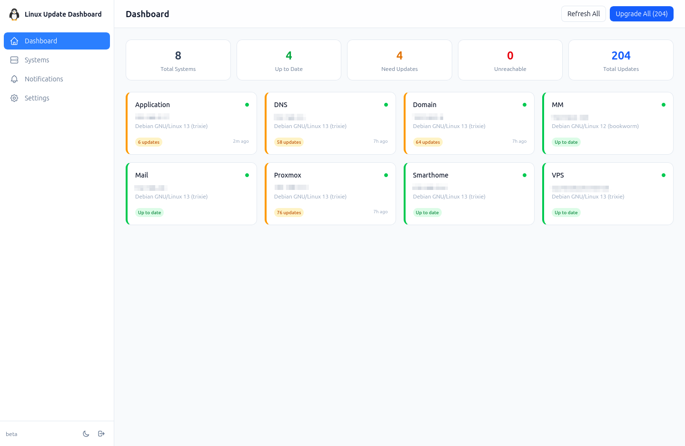
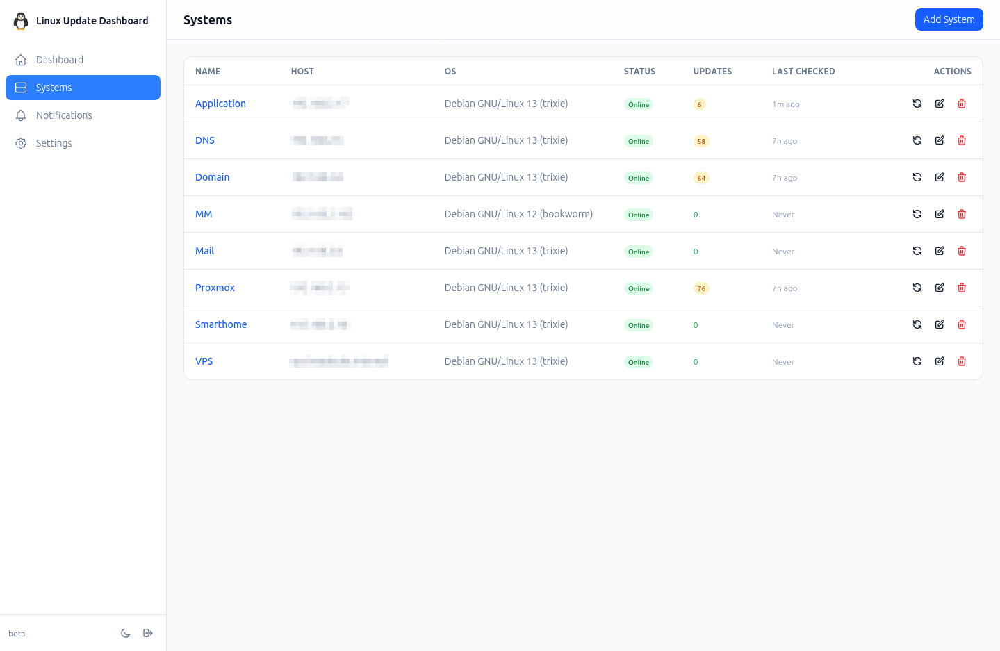
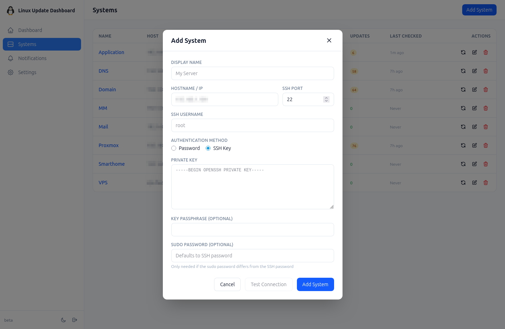
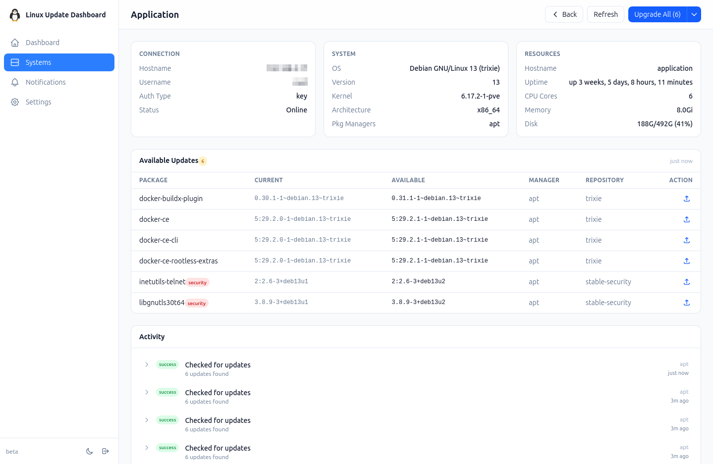
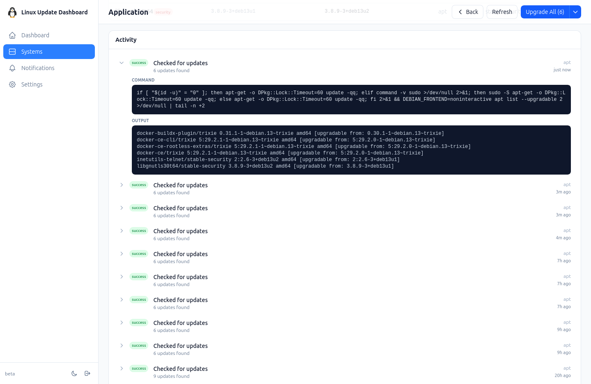
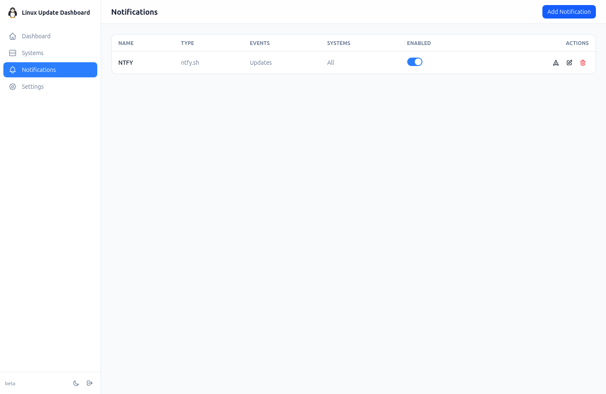
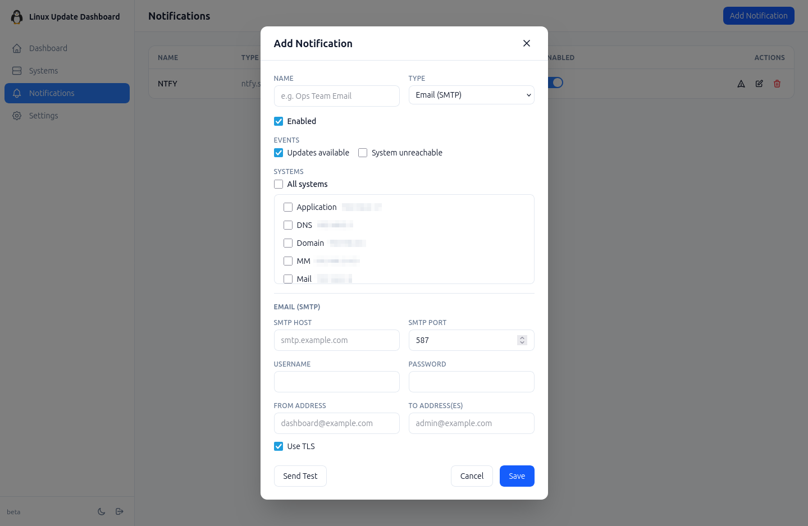
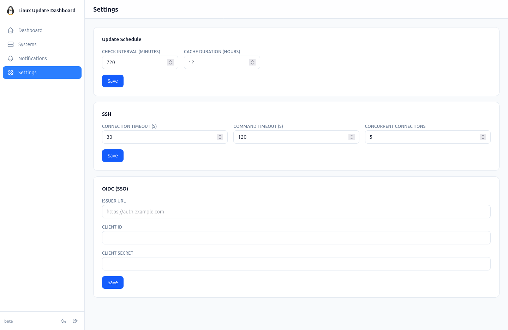

<div align="center">
  
</div>

<div align="center">

  [](https://github.com/TheDuffman85/linux-update-dashboard/actions/workflows/release.yml)
  [](https://github.com/TheDuffman85/linux-update-dashboard/actions/workflows/trivy-scan.yml)
  [](https://github.com/TheDuffman85/linux-update-dashboard/blob/main/LICENSE)
  [](https://github.com/TheDuffman85/linux-update-dashboard/commits/main)
  [](https://github.com/users/TheDuffman85/packages/container/package/linux-update-dashboard)

</div>

# Linux Update Dashboard

A self-hosted web app for managing Linux package updates across multiple servers. Connect via SSH, check for updates, and apply them from a single dashboard in your browser.

<div align="center">
  <a href="https://bun.sh/"></a>
  <a href="https://hono.dev/"></a>
  <a href="https://react.dev/"></a>
  <a href="https://vite.dev/"></a>
  <a href="https://tailwindcss.com/"></a>
  <a href="https://orm.drizzle.team/"></a>
  <a href="https://www.sqlite.org/"></a>
  <a href="https://www.docker.com/"></a>
</div>

## Features

- **Multi-distribution support:** APT (Debian/Ubuntu), DNF (Fedora/RHEL 8+), YUM (CentOS/older RHEL), Pacman (Arch/Manjaro), APK (Alpine), Flatpak, and Snap
- **Reusable credential vault:** store username/password, SSH key, or OpenSSH certificate credentials once and reuse them across systems
- **Auto-detection:** package managers and system info are detected automatically on first connection; you can disable individual managers per system
- **Granular updates:** upgrade everything at once or pick individual packages per system
- **Background scheduling:** periodic checks keep your dashboard up to date (configurable cache duration)
- **Flexible notifications:** set up multiple channels per event type (Email/SMTP, Gotify, MQTT, ntfy.sh, Telegram, Webhooks), scope them to specific systems, and pick which events trigger each channel
- **Home Assistant MQTT update entities:** publish one Linux Update Dashboard app update entity plus per-system package update entities with discovery, icons/images, rich JSON attributes, and optional install commands
- **Telegram bot integration:** bind a private Telegram chat for notifications, with optional bot commands for refresh and upgrades
- **Safer SSH workflows:** optional host-key verification with explicit trust approval, plus ProxyJump support for reaching internal hosts
- **Encrypted credentials:** SSH passwords and private keys are encrypted at rest with AES-256-GCM
- **Four auth methods:** password, Passkeys (WebAuthn), SSO (OpenID Connect), and API tokens for external integrations
- **SSH-safe upgrades:** upgrade commands run via nohup on the remote host, so they survive SSH disconnects and keep running even if the dashboard loses connection
- **Full upgrade:** run `apt full-upgrade` or `dnf distro-sync` from the dashboard for dist-level upgrades
- **Remote reboot:** trigger reboots from the UI with a dashboard-wide reboot-needed indicator
- **System duplication:** clone an existing system entry (including encrypted credentials) to quickly add similar servers
- **Exclude from Upgrade All:** make individual systems start unchecked in the Upgrade All Systems dialog
- **Visibility controls:** hide systems from the main dashboard without deleting them
- **Notification digests:** schedule notification delivery on a cron expression for batched digest summaries instead of immediate alerts
- **Dark mode:** dark/light theme with OS preference detection
- **Update history:** logs every check and upgrade operation per system
- **Real-time status:** see which systems are online, up to date, or need attention at a glance
- **Version info:** build version, commit hash, and branch displayed in the sidebar
- **Docker ready:** multi-stage Dockerfile with health check and a persistent volume for production

## Screenshots

### Dashboard
Overview of all systems with summary stats and color-coded update status at a glance.



### Systems List
Manage all connected servers with status, update counts, and quick actions.



### Add System
Add a new server via SSH using a saved credential, with package-manager detection, host-key trust, and ProxyJump support.



### System Detail
Detailed view of a single system showing connection info, OS details, resource usage, available packages, and upgrade history.



### Activity Log
Expandable history entries with the executed command and its full output.



### Notifications
Configure notification channels (Email/SMTP, Gotify, MQTT, ntfy.sh, Telegram, Webhooks) with per-event and per-system filtering.





### Settings
Configure update schedules, SSH timeouts, OIDC single sign-on, and API tokens.



## Quick Start

> [!CAUTION]
> **This application is designed for use on trusted local networks only.** It is **not** intended to be exposed directly to the internet. If you need remote access, place it behind a reverse proxy with proper TLS termination, authentication, and network-level access controls (e.g. VPN, firewall rules).

### Prerequisites

- [Bun](https://bun.sh) 1.x installed
- SSH access to at least one Linux server

### Installation

```bash
# Clone the repository
git clone https://github.com/TheDuffman85/linux-update-dashboard.git
cd linux-update-dashboard

# Install dependencies
bun install

# Generate an encryption key
export LUDASH_ENCRYPTION_KEY=$(openssl rand -base64 32)

# Start development servers
bun run dev
```

The frontend dev server runs on `http://localhost:5173` (proxies API calls to the backend on port 3001).

On first visit, you'll be guided through creating an admin account.

### Production Build

```bash
bun run build
NODE_ENV=production bun run start
```

The production server serves both the API and the built frontend on port 3001.

## Docker Deployment

### Using pre-built image (recommended)

```bash
# Generate your encryption key (required)
export LUDASH_ENCRYPTION_KEY=$(openssl rand -base64 32)

# Pull and run
docker run -d \
  -p 3001:3001 \
  -e LUDASH_ENCRYPTION_KEY=$LUDASH_ENCRYPTION_KEY \
  -v ludash_data:/data \
  ghcr.io/theduffman85/linux-update-dashboard:latest
```

Optional Docker Secrets variant:

```bash
mkdir -p ./secrets
openssl rand -base64 32 > ./secrets/ludash_encryption_key.txt

docker run -d \
  -p 3001:3001 \
  -e LUDASH_ENCRYPTION_KEY_FILE=/run/secrets/ludash_encryption_key \
  -v "$(pwd)/secrets/ludash_encryption_key.txt:/run/secrets/ludash_encryption_key:ro" \
  -v ludash_data:/data \
  ghcr.io/theduffman85/linux-update-dashboard:latest
```

### Docker Compose

```yaml
services:
  dashboard:
    image: ghcr.io/theduffman85/linux-update-dashboard:latest
    container_name: linux-update-dashboard
    restart: unless-stopped
    ports:
      - "3001:3001"
    volumes:
      - dashboard_data:/data
    environment:
      - LUDASH_ENCRYPTION_KEY=${LUDASH_ENCRYPTION_KEY}
      # Optional: use Docker secrets instead of direct env vars
      # - LUDASH_ENCRYPTION_KEY_FILE=/run/secrets/ludash_encryption_key
      # - LUDASH_SECRET_KEY_FILE=/run/secrets/ludash_secret_key
      - LUDASH_DB_PATH=/data/dashboard.db
      - NODE_ENV=production
      # Optional: set your public URL for stricter origin validation
      # - LUDASH_BASE_URL=https://dashboard.example.com
      # - LUDASH_TRUST_PROXY=true

volumes:
  dashboard_data:
```

The dashboard will be available at `http://localhost:3001`. Data is persisted in a Docker volume.

If you prefer Docker secrets with Compose, add a `secrets:` block and set `LUDASH_ENCRYPTION_KEY_FILE` instead of `LUDASH_ENCRYPTION_KEY`.

Example:

```yaml
services:
  dashboard:
    image: ghcr.io/theduffman85/linux-update-dashboard:latest
    container_name: linux-update-dashboard
    restart: unless-stopped
    ports:
      - "3001:3001"
    volumes:
      - dashboard_data:/data
    environment:
      - LUDASH_ENCRYPTION_KEY_FILE=/run/secrets/ludash_encryption_key
      - LUDASH_DB_PATH=/data/dashboard.db
      - NODE_ENV=production
    secrets:
      - ludash_encryption_key

secrets:
  ludash_encryption_key:
    file: ./secrets/ludash_encryption_key.txt

volumes:
  dashboard_data:
```

Create the secret file before starting:

```bash
mkdir -p ./secrets
openssl rand -base64 32 > ./secrets/ludash_encryption_key.txt
docker compose up -d
```

### Building locally

```bash
cd docker

# Generate your encryption key (required)
export LUDASH_ENCRYPTION_KEY=$(openssl rand -base64 32)

# Start the container
docker compose up -d
```

### Health Check

The Docker image includes a built-in `HEALTHCHECK` that verifies the web server is responding. Docker will automatically mark the container as `healthy` or `unhealthy`.

**Endpoint:** `GET /api/health` (localhost: no auth, external: requires authentication)

```bash
curl http://localhost:3001/api/health
# {"status":"ok"}
```

The health check runs every 30 seconds with a 10-second start period to allow for initialization. You can check the container's health status with:

```bash
docker inspect --format='{{.State.Health.Status}}' linux-update-dashboard
```

## Environment Variables

| Variable | Required | Default | Description |
|----------|----------|---------|-------------|
| `LUDASH_ENCRYPTION_KEY` | **Yes** | - | AES-256 key for encrypting stored SSH credentials |
| `LUDASH_ENCRYPTION_KEY_FILE` | No | - | Optional alternative: read `LUDASH_ENCRYPTION_KEY` value from file (Docker secrets) |
| `LUDASH_DB_PATH` | No | `./data/dashboard.db` | SQLite database file path |
| `LUDASH_SECRET_KEY` | No | Auto-generated | JWT session signing secret (auto-persisted to `.secret_key`) |
| `LUDASH_SECRET_KEY_FILE` | No | Auto-generated | Read `LUDASH_SECRET_KEY` value from file (Docker secrets) |
| `LUDASH_PORT` | No | `3001` | HTTP server port |
| `LUDASH_HOST` | No | `0.0.0.0` | HTTP server bind address |
| `LUDASH_BASE_URL` | No | `http://localhost:3001` | Public URL for WebAuthn/OIDC. When set, detected origin must match it. When unset, origin is inferred from request headers (Host/proto plus Origin/Referer heuristics), which works behind reverse proxies without extra config |
| `LUDASH_TRUST_PROXY` | No | `false` | Trust `X-Forwarded-*` headers from your reverse proxy (needed for forwarded host/proto detection when `LUDASH_BASE_URL` is set) |
| `LUDASH_LOG_LEVEL` | No | `info` | Server log level: `debug`, `info`, `warn`, or `error`. Routine per-attempt SSH and scheduler refresh logs are only shown at `debug` |
| `LUDASH_DEFAULT_CACHE_HOURS` | No | `12` | How long update results are cached before re-checking |
| `LUDASH_DEFAULT_SSH_TIMEOUT` | No | `30` | SSH connection timeout in seconds |
| `LUDASH_DEFAULT_CMD_TIMEOUT` | No | `120` | SSH command execution timeout in seconds |
| `LUDASH_MAX_CONCURRENT_CONNECTIONS` | No | `5` | Max simultaneous SSH connections |
| `NODE_EXTRA_CA_CERTS` | No | - | Path to a PEM CA bundle to trust additional/self-signed certificates for outbound TLS (OIDC, SMTP, Gotify, ntfy, webhooks, etc.) |
| `NODE_ENV` | No | - | Set to `production` for static file serving |

If you use `LUDASH_ENCRYPTION_KEY_FILE`, do not also set `LUDASH_ENCRYPTION_KEY`. If both `VAR` and `VAR_FILE` are set for the same setting, startup fails with a configuration error.

## Debugging SSH Connection Failures

For container-based installs, set `LUDASH_LOG_LEVEL=debug` and inspect the container logs:

```bash
docker logs -f linux-update-dashboard
```

At the default `info` level, the server logs startup, configuration, warnings, and errors without emitting per-attempt SSH connect start/success lines on every refresh. `debug` adds attempt-scoped SSH diagnostics and routine scheduler refresh logs to stdout/stderr so they appear in `docker logs`. Failed test-connection requests include a debug reference ID that you can match against the log entries.

Security constraints:

- Logged SSH diagnostics are intentionally limited to safe metadata such as host, port, username, auth type, elapsed time, and filtered auth/debug events.
- Passwords, sudo passwords, private keys, passphrases, tokens, and raw SSH payloads are never logged.
- If a diagnostic cannot be emitted safely, it is omitted.

These logs are intended for trusted operators on trusted hosts. Avoid enabling debug logging longer than needed.

## Authentication

Four auth methods are supported and can be used at the same time:

### Password

Standard username/password login. Passwords are hashed with bcrypt (cost factor 12). Sessions use long-lived JWTs (30-day expiry) in an HTTP-only cookie, with silent daily rolling refresh. Can be disabled from the Settings page, but only when at least one passkey or SSO provider is configured (enforced server-side to prevent lockout). Users can change their password from the Settings page.

> **Note:** Password login cannot be disabled unless at least one passkey or SSO provider is configured, preventing account lockout.

### Passkeys (WebAuthn)

Register hardware keys or platform authenticators (Touch ID, Windows Hello) for passwordless login. Each passkey can be given a custom name (e.g. "YubiKey", "MacBook") during registration and renamed later from the Settings page. Works behind reverse proxies without extra configuration; set `LUDASH_BASE_URL` for stricter origin validation.

### SSO (OpenID Connect)

Hook up any OIDC-compatible identity provider (Authentik, Keycloak, Okta, Auth0, etc.) through the Settings page. Users get auto-provisioned on first login. Set the callback URL in your provider to:

```
{LUDASH_BASE_URL}/api/auth/oidc/callback
```

#### Self-signed CA support

If your IdP (or other outbound HTTPS target) uses a private/self-signed CA, mount the CA cert into the container and set `NODE_EXTRA_CA_CERTS`:

```yaml
services:
  dashboard:
    image: ghcr.io/theduffman85/linux-update-dashboard:latest
    volumes:
      - ./certs/homelab-ca.crt:/etc/ssl/certs/homelab-ca.crt:ro
    environment:
      - NODE_EXTRA_CA_CERTS=/etc/ssl/certs/homelab-ca.crt
```

For non-Docker runs, set `NODE_EXTRA_CA_CERTS` to a local PEM file path before starting the app.

### API Tokens

Bearer tokens for external API consumers (e.g. [gethomepage](https://gethomepage.dev/) widgets, scripts, monitoring). Create and manage tokens from the Settings page.

- **Permission levels:** read-only (GET/HEAD only) or read/write
- **Configurable expiry:** 30, 60, 90, 365 days, or never
- **Secure storage:** only the SHA-256 hash is stored; the plain token is shown once on creation
- **Scoped access:** tokens cannot access management endpoints (auth, settings, tokens, passkeys, notifications)
- **Rate-limited:** failed bearer attempts are rate-limited (20/min per IP), max 25 tokens per user

Usage:
```bash
curl -H "Authorization: Bearer ludash_..." http://localhost:3001/api/dashboard/stats
```

## Notification Channels

Notification channels are configured from the **Notifications** page. You can create multiple channels of different types, subscribe each one to different events, limit them to specific systems, and choose whether they deliver immediately or on a cron-based digest schedule.

### Common Channel Options

Every channel supports the same high-level behavior:

- **Channel types:** `Email`, `Gotify`, `MQTT`, `ntfy`, `Telegram`, and `Webhook`
- **Events:** `updates`, `unreachable`, and `appUpdates`
- **Default events:** new channels default to `updates` and `appUpdates`
- **System scope:** `All systems` or a selected list of system IDs
- **Schedule:** `immediate` delivery or a cron expression for digest delivery
- **Test send:** use **Send Test** to validate a saved channel or inline config
- **Secrets:** passwords, tokens, and webhook secrets are encrypted at rest

Digest schedules buffer matching events until the next cron run. Immediate channels send as soon as the event is detected. Delivery diagnostics are stored with the channel, including the last status, response code, and a short response/error summary.

### Channel Overview

| Type | Best for | Notes |
|------|----------|-------|
| `Email` | inbox-based alerts | SMTP transport with optional auth and importance override |
| `Gotify` | mobile/self-hosted push | app token stored encrypted |
| `MQTT` | brokers, automations, and Home Assistant | generic event publishing plus optional Home Assistant MQTT Update entities |
| `ntfy` | lightweight push topics | topic-based delivery with optional bearer token |
| `Telegram` | chat notifications and optional remote actions | private-chat only |
| `Webhook` | integrations with automation tools, chat ops, and custom receivers | supports templates, auth, retries, and a Discord preset |

### MQTT

MQTT channels support two related behaviors:

- generic event publishing to a configured topic using the same notification events as the other providers
- optional Home Assistant MQTT Update discovery/state publishing with one app entity plus one per-system package-update entity

Home Assistant mode details:

- discovery topics use retained config payloads
- entity state is synced immediately after checks, upgrades, reconnects, startup, notification edits, and system edits
- digest schedules only affect the generic MQTT event topic, not Home Assistant state
- the Home Assistant device name is configured explicitly in the MQTT channel settings
- discovery config includes `icon: mdi:linux`, `entity_picture`, and `origin.url`
- `entity_picture` points to the local dashboard logo URL (`{LUDASH_BASE_URL}/assets/logo.png` in production)
- the app entity is visibility-only
- per-system entities expose synthetic fingerprint versions for the current pending update set, not real package-version pairs
- Home Assistant update state and JSON attributes are published on separate retained topics:
  - `.../state` carries the update entity state payload (`installed_version`, `latest_version`, `title`, `release_summary`, `release_url`, `in_progress`)
  - `.../attributes` carries the extended JSON attributes payload
- optional install commands map to the standard per-system upgrade action

Home Assistant app-update entity attributes include:

- `update_available`
- `current_branch`
- `origin_url`
- `repository_url`
- `channel_id`
- `channel_name`
- `device_name`
- `check_reason`

Home Assistant per-system update entity attributes include:

- `update_count`
- `security_update_count`
- `needs_reboot`
- `reachable`
- `active_operation`
- `system`
- `packages`

The `system` JSON attribute object contains the detected host metadata that the dashboard already knows about, such as:

- system ID/name/hostname/port/username
- package manager and detected/disabled package managers
- OS name/version, kernel, uptime, architecture, CPU, memory, disk, boot ID
- flags such as `ignore_kept_back_packages`, `exclude_from_upgrade_all`, `needs_reboot`, and reachability
- timestamps such as `last_seen_at`, `system_info_updated_at`, `created_at`, and `updated_at`

The `packages` JSON attribute array contains one object per pending update with:

- `pkg_manager`
- `package_name`
- `current_version`
- `new_version`
- `architecture`
- `repository`
- `is_security`
- `cached_at`

### Telegram

Telegram channels store their own bot token, private-chat binding, and optional command capability.

#### Notification-only setup

1. Create a bot with [@BotFather](https://t.me/BotFather) and copy the bot token.
2. In the dashboard, go to **Notifications** and create a new `Telegram` channel.
3. Paste the bot token, choose events/system scope, and save the channel.
4. Re-open that Telegram channel and click **Create Link**.
5. Open the generated `https://t.me/<bot>?start=<nonce>` link in Telegram from the private account that should receive notifications.
6. Start the bot from Telegram. The dashboard will bind that private chat to the notification channel.
7. Use **Send Test** from the notification editor to verify delivery.

Binding details:

- Telegram notifications support **private chats only** in v1
- binding uses a **single-use deep link** that expires after **10 minutes**
- the channel shows a binding status of `unbound`, `pending`, or `bound`
- changing the bot token clears the existing binding and requires linking again

#### Optional Telegram commands

Telegram commands are **disabled by default**. Enable them only if that private chat should be allowed to trigger dashboard actions.

When **Enable bot commands** is turned on for a linked Telegram channel:

- the dashboard auto-generates a dedicated **write-capable API token** for that channel
- only the normal SHA-256 hash is stored in the `api_tokens` table
- the bot keeps an encrypted copy in the Telegram channel config so it can call existing API routes
- the notification editor shows token status plus created, last-used, and expiry timestamps
- you can **reissue** the token if it is missing, expired, or was deleted manually

The generated command token is automatically revoked when:

- commands are disabled
- the Telegram chat is unlinked
- the Telegram notification channel is deleted
- the Telegram bot token changes

If the backing API token is deleted manually, commands stop working by design until you reissue it from the channel editor.

#### Telegram commands

Supported commands:

- `/help`
- `/menu`
- `/status`
- `/refresh <system-id|all>`
- `/packages <system-id>`
- `/upgrade <system-id|all>`
- `/fullupgrade <system-id|all>`
- `/upgradepkg <system-id> <package>`

Behavior:

- Telegram registers `/help` and `/menu` in Telegram's native command picker
- `/status`, `/refresh`, and `/packages` remain available as typed commands and through `/menu`
- `/menu` opens an inline menu with `Status`, `Refresh`, `Upgrade`, `Full upgrade`, `Upgrade package`, and `Show packages`
- `/status` shows the current status for the systems this channel is allowed to control
- `/refresh`, `/upgrade`, and `/fullupgrade` also accept `all` to target every allowed system that matches that action
- `/packages` lists the currently cached package updates for one allowed system, including current and target versions
- the system picker in `/menu` includes an `All` button for refresh, upgrade, and full-upgrade flows
- `/upgrade`, `/fullupgrade`, and `/upgradepkg` require an explicit confirmation button before execution, including `all`
- confirmation buttons expire after **5 minutes**
- `/fullupgrade` is only offered for systems that actually support full-upgrade semantics
- command scope follows the channel's configured `systemIds`; a scoped channel can only act on those same systems

#### Telegram security notes

- command access is **private-chat-only**
- commands are **off by default**
- mutating commands require confirmation
- bot tokens and generated command tokens are **encrypted at rest**
- if you only need alerts, leave commands disabled and use Telegram as a notification-only channel

### Webhooks

Webhook channels are intended for custom integrations such as Home Assistant, n8n, Node-RED, custom APIs, chat bridges, and Discord-compatible endpoints.

#### Webhook capabilities

- methods: `POST`, `PUT`, or `PATCH`
- presets: `custom` or `discord`
- authentication: none, bearer token, or basic auth
- request body modes: plain text, JSON template, or form-encoded fields
- optional query parameters and custom headers
- configurable timeout, retry count, retry delay, and optional insecure TLS for self-signed/internal targets

Default webhook behavior:

- timeout defaults to **10 seconds**
- retries default to **2**
- retry delay defaults to **30 seconds**
- delivery diagnostics record the last HTTP status and a truncated response body or error message

#### Webhook template variables

Webhook templates use simple Mustache variable tags. Only dotted `event.*` paths are allowed; sections, loops, and other Mustache control tags are rejected.

Available values include:

- `{{event.title}}`, `{{event.body}}`, `{{event.priority}}`, `{{event.sentAt}}`
- `{{event.eventTypes.0}}`, `{{event.tags.0}}`, `{{event.tagsCsv}}`
- `{{event.totals.totalUpdates}}`, `{{event.totals.totalSecurity}}`, `{{event.totals.unreachableSystems}}`
- `{{event.updatesText}}`, `{{event.unreachableText}}`, `{{event.appUpdateText}}`
- `{{event.json}}`, `{{event.updatesJson}}`, `{{event.unreachableJson}}`, `{{event.appUpdateJson}}`
- JSON-safe variants such as `{{event.titleJson}}`, `{{event.bodyJson}}`, `{{event.sentAtJson}}`, and `{{event.decoratedTitleJson}}`

Use the `...Json` helpers when you are embedding strings inside a JSON document. Example:

```json
{
  "title": {{event.decoratedTitleJson}},
  "message": {{event.bodyJson}},
  "rawEvent": {{event.json}}
}
```

#### Webhook validation and security

- webhook URLs must be valid `http` or `https` URLs
- embedded credentials in the URL are rejected
- the metadata endpoints `169.254.169.254` and `metadata.google.internal` are blocked
- reserved headers such as `Authorization`, `Host`, `Content-Length`, `Connection`, and `Cookie` cannot be set manually
- if you need auth, use the built-in bearer/basic auth settings instead of custom `Authorization` headers
- sensitive header values, auth secrets, and sensitive form fields are masked in the UI and reused safely on update

#### Discord preset

The `discord` preset keeps the webhook in JSON mode and uses a Discord embed payload based on the notification title/body. Existing legacy Discord templates are upgraded automatically to the current JSON-safe format when loaded.

## Supported Package Managers

| Package Manager | Distributions |
|----------------|---------------|
| APT | Debian, Ubuntu, Linux Mint |
| DNF | Fedora, RHEL 8+, AlmaLinux, Rocky |
| YUM | CentOS, older RHEL |
| Pacman | Arch Linux, Manjaro |
| APK | Alpine Linux |
| Flatpak | Any (cross-distribution) |
| Snap | Any (cross-distribution) |

Package managers are auto-detected on each system over SSH when you test the connection or run the first check. Detected managers are enabled by default, and you can toggle them individually per system in the edit dialog. Security updates are identified where possible (e.g. APT security repos).

## Project Structure

```
├── .github/                  # CI/CD workflows and Dependabot
│   ├── dependabot.yml
│   └── workflows/
│       ├── dev-build.yml     # Dev branch Docker builds
│       ├── release.yml       # Production releases
│       └── trivy-scan.yml    # Container security scanning
├── client/                   # React SPA
│   ├── lib/                  # TanStack Query hooks and API client
│   ├── components/           # Shared UI components
│   ├── context/              # Auth and toast providers
│   ├── hooks/                # Custom hooks
│   ├── pages/                # Route pages
│   └── styles/               # Tailwind CSS
├── server/                   # Hono backend
│   ├── auth/                 # Password, WebAuthn, OIDC, session handling
│   ├── db/                   # SQLite + Drizzle schema (9 tables)
│   ├── middleware/           # Auth and rate-limit middleware
│   ├── routes/               # API route handlers
│   ├── services/             # Business logic, caching, scheduling
│   └── ssh/                  # SSH connection manager + parsers
├── tests/server/             # Bun test suites
├── docker/                   # Dockerfile, compose, entrypoint
│   └── test-systems/         # Docker test containers
├── run.sh                    # Local dev/production/test runner
├── reset-dev-branch.sh       # Reset dev branch to main
├── vite.config.ts            # Vite + Tailwind config
└── package.json
```

## Development

There's a helper script `run.sh` to manage services.

**Development mode** (hot reload, server on :3001, client on :5173):
```bash
./run.sh dev
```

**Production mode** (build and start on :3001):
```bash
./run.sh
```

Or use the Bun scripts directly:

```bash
# Start both dev servers (backend :3001 + Vite :5173 with HMR)
bun run dev

# Or run them individually
bun run dev:server           # Backend only (with watch mode)
bun run dev:client           # Vite frontend only

# Run tests
bun test

# Type check
bun run check
```
The app creates and upgrades the SQLite schema automatically on startup.

### Test Systems

The project includes Docker-based test systems that simulate real Linux servers with pending updates. This lets you develop and test the dashboard without needing actual remote machines.

**Start the dashboard with test systems:**
```bash
./run.sh test
```

This will:
1. Stop any running dev/production services
2. Build and start 10 Docker containers (including Alpine, fish-shell, and sudo-password APT fixtures)
3. Build the frontend in production mode
4. Start the production server on `:3001`

The server initializes or upgrades the SQLite schema automatically during startup.

**SSH credentials for all test systems:**
- User: `testuser`
- Password: `testpass`
- `Sudo password`: `testpass` (required for `ludash-test-ubuntu-sudo` and `ludash-test-debian-fish-sudo`, optional for others)
- Passwordless `sudo` is pre-configured on all test systems except `ludash-test-ubuntu-sudo` and `ludash-test-debian-fish-sudo`

| Container | SSH Port | Package Manager | Login Shell | Base Image |
|-----------|----------|-----------------|-------------|------------|
| `ludash-test-ubuntu` | 2001 | APT | `bash` | Ubuntu 24.04 |
| `ludash-test-fedora` | 2002 | DNF | `bash` | Fedora 41 |
| `ludash-test-centos7` | 2003 | YUM | `bash` | CentOS 7 |
| `ludash-test-archlinux` | 2004 | Pacman | `bash` | Arch Linux |
| `ludash-test-flatpak` | 2005 | Flatpak | `bash` | Ubuntu 24.04 |
| `ludash-test-snap` | 2006 | Snap | `bash` | Ubuntu 24.04 |
| `ludash-test-ubuntu-sudo` | 2007 | APT (sudo password) | `bash` | Ubuntu 24.04 |
| `ludash-test-debian-fish` | 2008 | APT | `fish` | Debian 12 |
| `ludash-test-debian-fish-sudo` | 2009 | APT (sudo password) | `fish` | Debian 12 |
| `ludash-test-alpine` | 2010 | APK | `bash` | Alpine 3.16 |

To add a test system in the dashboard, use `host.docker.internal` (or `172.17.0.1` on Linux) as the hostname with the corresponding SSH port.

Each container is built with **older package versions** pinned from archived repositories, while current repos remain active. This means `apt list --upgradable`, `dnf check-update`, `pacman -Qu`, `apk list -u`, etc. will always report pending updates — giving you realistic data to work with in the dashboard.

The Docker Compose file and all Dockerfiles are in [`docker/test-systems/`](docker/test-systems/).

### Branch Management

To reset the `dev` branch to match `main` (force push):
```bash
./reset-dev-branch.sh
```

## API Overview

All endpoints require authentication unless noted. Responses are JSON.

### Health

| Method | Endpoint | Description |
|--------|----------|-------------|
| GET | `/api/health` | Health check (localhost: no auth, external: requires auth) |

### Auth (`/api/auth/*`)

| Method | Endpoint | Description |
|--------|----------|-------------|
| GET | `/api/auth/status` | Auth state, setup status, OIDC availability |
| POST | `/api/auth/setup` | Create initial admin account |
| POST | `/api/auth/login` | Password login |
| POST | `/api/auth/logout` | Clear session |
| GET | `/api/auth/me` | Current user info |
| POST | `/api/auth/change-password` | Change the current user's password |
| POST | `/api/auth/webauthn/register/options` | Start passkey registration |
| POST | `/api/auth/webauthn/register/verify` | Complete passkey registration |
| POST | `/api/auth/webauthn/login/options` | Start passkey login |
| POST | `/api/auth/webauthn/login/verify` | Complete passkey login |
| GET | `/api/auth/oidc/login` | Redirect to OIDC provider |
| GET | `/api/auth/oidc/callback` | OIDC callback handler |

### Systems (`/api/systems/*`)

| Method | Endpoint | Description |
|--------|----------|-------------|
| GET | `/api/systems` | List all systems with update counts |
| GET | `/api/systems/:id` | System detail with updates and history |
| POST | `/api/systems` | Add a new system |
| PUT | `/api/systems/reorder` | Reorder systems |
| PUT | `/api/systems/:id` | Update system configuration |
| POST | `/api/systems/test-connection` | Test SSH connectivity |
| POST | `/api/systems/:id/reboot` | Reboot a system |
| POST | `/api/systems/:id/revoke-host-key` | Clear the stored trusted host key |
| DELETE | `/api/systems/:id` | Remove a system |
| GET | `/api/systems/:id/updates` | Cached updates for a system |
| GET | `/api/systems/:id/history` | Upgrade history for a system |

### Updates

| Method | Endpoint | Description |
|--------|----------|-------------|
| POST | `/api/systems/:id/check` | Check one system for updates |
| POST | `/api/systems/check-all` | Check all systems (background) |
| POST | `/api/systems/:id/upgrade` | Upgrade all packages on a system |
| POST | `/api/systems/:id/full-upgrade` | Full/dist upgrade on a system |
| POST | `/api/systems/:id/upgrade/:packageName` | Upgrade a single package |
| POST | `/api/cache/refresh` | Invalidate cache and re-check all systems |
| GET | `/api/jobs/:id` | Poll background job status |

### Notifications (`/api/notifications/*`)

| Method | Endpoint | Description |
|--------|----------|-------------|
| GET | `/api/notifications` | List all notification channels |
| PUT | `/api/notifications/reorder` | Reorder notification channels |
| GET | `/api/notifications/:id` | Get a notification channel |
| POST | `/api/notifications` | Create a notification channel |
| PUT | `/api/notifications/:id` | Update a notification channel |
| DELETE | `/api/notifications/:id` | Delete a notification channel |
| POST | `/api/notifications/:id/telegram/link` | Create a one-time Telegram chat binding link |
| POST | `/api/notifications/:id/telegram/unlink` | Remove the Telegram chat binding and revoke any generated command token |
| POST | `/api/notifications/:id/telegram/reissue-command-token` | Rotate the Telegram command token for a linked channel with commands enabled |
| POST | `/api/notifications/test` | Test a notification config inline (before saving) |
| POST | `/api/notifications/:id/test` | Send a test notification |

### Credentials (`/api/credentials/*`)

| Method | Endpoint | Description |
|--------|----------|-------------|
| GET | `/api/credentials` | List saved credentials |
| PUT | `/api/credentials/reorder` | Reorder credentials |
| GET | `/api/credentials/:id` | Get a credential with masked secrets |
| POST | `/api/credentials` | Create a credential |
| PUT | `/api/credentials/:id` | Update a credential |
| DELETE | `/api/credentials/:id` | Delete a credential |

### Passkeys (`/api/passkeys/*`)

| Method | Endpoint | Description |
|--------|----------|-------------|
| GET | `/api/passkeys` | List passkeys for the authenticated user |
| PATCH | `/api/passkeys/:id` | Rename a passkey |
| DELETE | `/api/passkeys/:id` | Remove a passkey |

### API Tokens (`/api/tokens/*`)

| Method | Endpoint | Description |
|--------|----------|-------------|
| GET | `/api/tokens` | List tokens for the authenticated user |
| POST | `/api/tokens` | Create a new token (name, expiresInDays, readOnly) |
| PATCH | `/api/tokens/:id` | Rename a token |
| DELETE | `/api/tokens/:id` | Revoke a token |

### Dashboard & Settings

| Method | Endpoint | Description |
|--------|----------|-------------|
| GET | `/api/dashboard/stats` | Summary statistics |
| GET | `/api/dashboard/systems` | All systems with status metadata |
| GET | `/api/settings` | Current settings |
| PUT | `/api/settings` | Update settings |

## Security

- **Credential encryption:** SSH passwords and private keys are encrypted at rest using AES-256-GCM with per-entry random IVs and auth tags
- **Notification secrets:** SMTP passwords, Gotify app tokens, ntfy tokens, Telegram bot tokens, Telegram command tokens, and webhook secrets are also encrypted at rest within notification channel configs
- **Key derivation:** supports both raw base64 keys and passphrase-derived keys (PBKDF2-SHA256, 480k iterations)
- **Session security:** HTTP-only, SameSite=Lax cookies with JWT (HS256)
- **CSRF protection:** state-changing API requests require a per-session CSRF token header
- **Input validation:** strict type, format, and range validation on all API inputs
- **Notification URL validation:** outbound notification URLs are validated for correct format (http/https); private/local targets are allowed since they are admin-configured
- **Rate limiting:** auth endpoints are rate-limited (3 req/min for setup, 5 req/min for login and WebAuthn verify, 20 failed bearer attempts/min per IP)
- **API token security:** only SHA-256 hashes stored, tokens blocked from management endpoints, CSRF skipped for stateless bearer requests
- **Telegram command safety:** Telegram commands are private-chat-only, disabled by default, scoped to the channel's allowed systems, and mutating actions require confirmation
- **Password-disable safeguard:** password login cannot be disabled unless a passkey or SSO is configured (enforced server-side)
- **Timing-safe login:** a pre-computed dummy hash is always compared on failed lookups to prevent username enumeration
- **Encrypted OIDC secrets:** OIDC client secrets are encrypted at rest alongside SSH credentials
- **Passphrase key derivation:** encryption keys can be raw base64 or passphrases derived via PBKDF2-SHA256 (480k iterations)
- **Concurrent access control:** per-system mutex prevents conflicting SSH operations
- **Connection pooling:** semaphore-based concurrency limiting to prevent SSH connection exhaustion

## SSH-Safe Upgrades

All upgrade operations (upgrade all, full upgrade, single package) run via **nohup** on the remote system, so they survive SSH connection drops. If your network blips or the dashboard restarts mid-upgrade, the process keeps running on the server.

### How it works

1. **Sudo handling** — if a sudo password is configured, it is sent only over the live SSH stdin stream to a one-time `sudo` launch of the background process. The password is never written to files or environment variables. For non-password sudo, detached commands use `sudo -n`.
2. **Temp script** — the upgrade command is base64-encoded, written to a temporary script on the remote host, and launched with `nohup` in the background.
3. **Live streaming** — output is streamed back to the dashboard in real time using `tail --pid`, which automatically stops when the process finishes.
4. **Exit code capture** — the script writes its exit code to a companion file, which the dashboard reads after the process completes.
5. **Fail-safe behavior** — if SSH-safe `nohup` setup fails (e.g. `mktemp` unavailable), the upgrade is marked failed instead of falling back to unsafe direct execution.

### Connection loss during upgrade

If the SSH connection drops while monitoring, the dashboard shows a warning:

> *SSH connection lost during upgrade. The process may still be running on the remote system.*

The upgrade itself continues on the remote host unaffected. Temporary files are cleaned up once the exit code is read.

### What uses SSH-safe mode

| Operation | SSH-safe |
|-----------|----------|
| Upgrade all packages | Yes |
| Full upgrade (dist upgrade) | Yes |
| Upgrade single package | Yes |
| Check for updates | No (read-only, safe to retry) |
| Reboot | No (fire-and-forget) |

The UI marks SSH-safe operations with an **SSH-safe** badge in the activity history.

## Star History

[](https://star-history.com/#TheDuffman85/linux-update-dashboard&Date)
